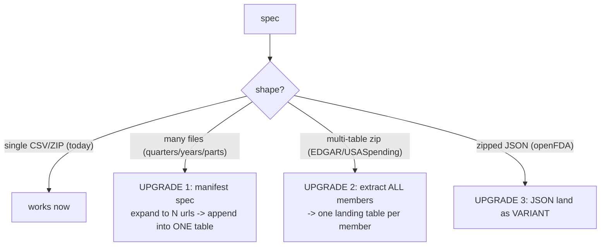

# Plan: Acquire it all — harm endpoints + ownership + dark money + spending depth

## Context

Grounded this session against the live warehouse (349M rows / 1,789 tables) and the public-data landscape. Your money/donation data is deep; the **ownership graph** and **harm endpoints** are stubs. This plan fills every gap. Existing machine (do not rebuild): server-side fetch (`RIPPLE_FETCH_TO_STAGE`, now gzip-on-fly), zip-member unzip, positional ragged-CSV COPY, density gate + `INGEST_RUNS` + `SOURCE_REGISTRY` + atomic swap. Specs live in scripts/server\_side\_specs.py; loader in scripts/server\_side\_load.py; procs/egress in infra/ddl/08\_bulk\_ingest.sql; host mirror in scripts/intake.py.

Confirmed real endpoints (host in parens; \* = needs adding to `RIPPLE_BULK_EGRESS`):

- SEC insider ownership (Form 3/4/5): `www.sec.gov/files/structureddata/data/insider-transactions-data-sets/<YYYYqQ>_form345.zip` — quarterly TAB TSVs, multi-member. (www\.sec.gov, allowed)
- SEC financial statement sets: `www.sec.gov/files/dera/data/financial-statement-data-sets/<YYYYqQ>.zip`. (allowed)
- NHTSA recalls/complaints/FARS flat files (static.nhtsa.gov\* / data.transportation.gov\*).
- DOL enforcement — OSHA inspections+violations, WHD wage-theft (whisard), MSHA (enforcedata.dol.gov\*).
- openFDA drug/device enforcement + adverse events — zipped **JSON**, multi-part, `download.json` index (download.open.fda.gov\*).
- USASpending award archives FY2008+ and subawards — per-agency/FY zips of CSVs (files.usaspending.gov\*).
- FEC independent expenditures / PAC summaries / operating expenditures — `www.fec.gov/files/bulk-downloads/<YYYY>/` (allowed; watch the S3 302 — cross-host redirect is blocked).
- IRS 990 e-file: index CSVs `s3.amazonaws.com/irs-form-990/index_<YYYY>.csv`\* (easy) + the per-filing **XML** return corpus (bespoke; Schedule I grants + Schedule R related-orgs = the dark-money graph).
- SAM exclusions (debarment): data.sam.gov API — **needs a free API key** (keyed path already built).

### Three loader upgrades gate the big sources

## Implementation steps

1. **Egress + host mirror (one DDL edit + redeploy).** Add to `RIPPLE_BULK_EGRESS` VALUE\_LIST and mirror in `intake.py ALLOWED_HOSTS`: `static.nhtsa.gov`, `data.transportation.gov`, `enforcedata.dol.gov`, `download.open.fda.gov`, `files.usaspending.gov`, `s3.amazonaws.com`, `arlweb.msha.gov`. (www\.sec.gov, www\.irs.gov, www\.fec.gov already present.)

2. **Loader UPGRADE 1 — manifest specs (multi-file append).** Add an optional `manifest` to a spec: a list of URLs (or a resolver that returns a list) that all share a schema and append into ONE landing table (fetch each -> COPY append -> single swap). Unblocks SEC quarters, USASpending FY archives, openFDA parts, 990 index years. Touches `load_spec` in scripts/server\_side\_load.py.

3. **Loader UPGRADE 2 — extract all zip members.** Generalize `RIPPLE_UNZIP_MEMBER_TO_STAGE` usage so a `zip` spec can land EACH member as its own table (e.g. EDGAR `SUBMISSION`, `REPORTINGOWNER`, `NONDERIV_TRANS`, `DERIV_TRANS`). New `members` facet: map member-pattern -> table suffix.

4. **Loader UPGRADE 3 — JSON landing (VARIANT).** For `kind='json'`: COPY the zipped JSON into a single `RAW VARIANT` column (TYPE=JSON), skip header/positional logic. openFDA only; downstream dbt flattens.

5. **Phase 1 — Harm endpoints (workhorse, high mission-leverage).** Specs + pours: NHTSA recalls / complaints / FARS fatalities; OSHA inspections + violations; DOL WHD wage-theft (whisard); MSHA mine safety. These put a person on the other end of the money. (SAM exclusions deferred to Step 9 — needs a key.)

6. **Phase 2 — Money-out + spending depth.** FEC independent expenditures + PAC summaries + operating expenditures (handle the S3 302: use the direct fec.gov file path, or add the S3 host if it redirects). USASpending award archives FY2008+ (manifest over agency/year) + subawards.

7. **Phase 3 — Ownership graph (SEC EDGAR structured sets).** Insider transactions (Form 345) all quarters 2006->now via manifest+multi-member (TAB); financial statement data sets quarterly. This is the who-controls-whom backbone — highest analytical payoff.

8. **Phase 4 — Dark money + FDA (bespoke corpora).** (a) openFDA drug/device enforcement + adverse events -> VARIANT (Upgrade 3 + manifest). (b) IRS 990 e-file: land the index CSVs first (easy), then the XML return corpus with a dedicated parser proc extracting Schedule I (grants out) + Schedule R (related orgs) as edge tables — the dark-money graph. Full EDGAR `submissions.zip` is intentionally SKIPPED (structured sets cover ownership without the giant many-JSON archive).

9. **Phase 5 — SAM exclusions + wire to the spine + refresh.** SAM exclusions once you drop a free API key into `RIPPLE_API_KEY` (keyed path exists). Then dbt staging models over the new tables, joined to the entity spine (NPI, EIN, UEI/DUNS, CIK, company name), and opt-in scheduled refresh for the sources that update.

## Verification

- Per source: row count jumps to the real universe AND density > 0 on a key column (the `SAMPLE (10000 ROWS)` + `COUNT_IF(<key> IS NOT NULL AND <key> <> '')` check used this session); `INGEST_RUNS` latest = `success`; `SOURCE_REGISTRY` row landed.
- Per upgrade: manifest appends N files into one table with correct total; multi-member yields the expected member tables; JSON lands as queryable VARIANT (`SELECT RAW:field ...`).
- Spine check: sample-join each new harm/ownership table to an existing spine table (e.g. OSHA -> employer name/UEI; insider -> CIK -> company) and confirm non-trivial match rate.
- Guardrails: `RIPPLE_BULK_REFRESH_TASK` stays SUSPENDED unless you say otherwise; budget monitor watched (currently 300cr / \~190 free — a full historical backfill of SEC+USASpending+990 is the one that could move it; I'll checkpoint before the heaviest pours).

## Decisions that are yours (RED)

- **Order.** Default is leverage-first: Harm (Phase 1) -> Ownership (Phase 3) -> the rest. Say the word to reprioritize.
- **990 depth.** Index-only (cheap, gives filer + XML links) vs the full XML parse (Schedule I/R dark-money graph — the real prize, but the heaviest build). I recommend full, staged after everything else.
- **SAM API key.** Blocked until you provide a free data.sam.gov key.
- **Scope of "harm."** FDA adverse-event data is huge and messy (VARIANT); confirm you want the adverse events, not just enforcement/recalls.

## Critical Files

- scripts/server\_side\_load.py - the three loader upgrades (manifest, multi-member, JSON) live here.
- scripts/server\_side\_specs.py - all new source specs.
- infra/ddl/08\_bulk\_ingest.sql - egress host additions; possible JSON file format + multi-member unzip tweak.
- scripts/intake.py - keep `ALLOWED_HOSTS` in sync with egress.
- outputs/DATA\_AUDIT\_AND\_BACKFILL\_PLAN\_2026-07-23.md - prior audit that already flagged 990 e-file + SAM; cross-check before pouring.
