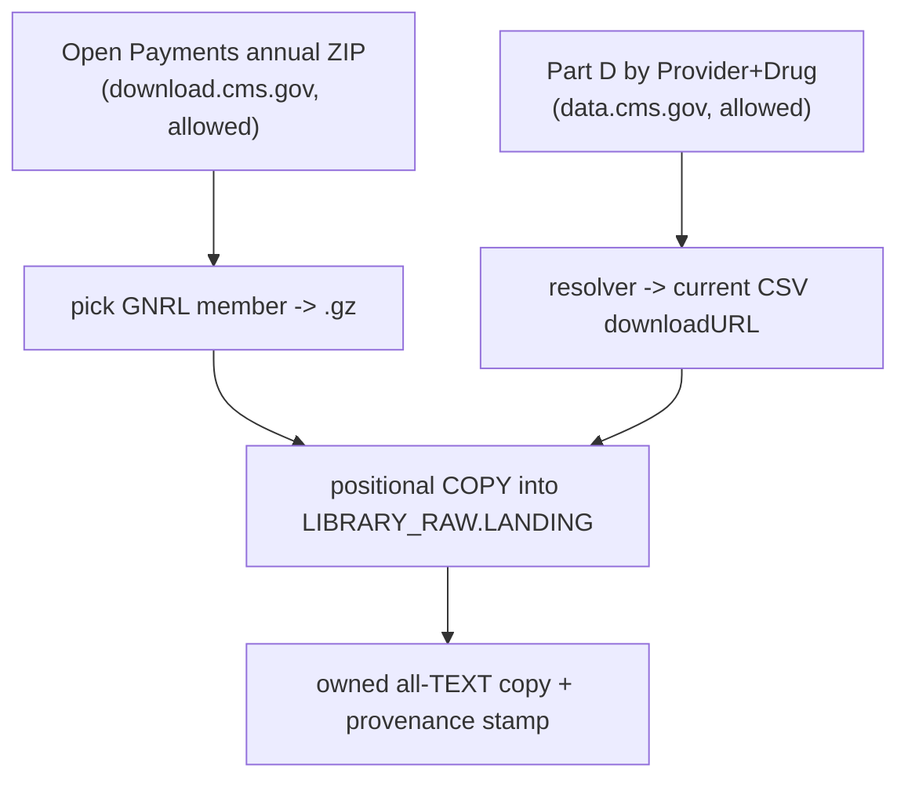

# Plan: Add CMS bulk sources to the server-side workhorse

## Context

**Task 1 (double-check) is complete and fully green — read-only, verified this session:**

| Check | Result |
|---|---|
| Row counts | CFPB `17,179,788`, GLEIF `3,382,301`, IRS_EO_PR `2,587` — exact match |
| Density | CFPB 99.9% `Complaint ID` / 100% `Company`; GLEIF 100% `LEI` — real, not blank |
| Last run status | all three `success` in `LIBRARY_META.INGEST_LOGS.INGEST_RUNS` |
| 5 procs | `RIPPLE_FETCH_TO_STAGE`, `RIPPLE_FETCH_TO_STAGE_KEYED`, `RIPPLE_UNZIP_MEMBER_TO_STAGE` (in LANDING) + `RIPPLE_REFRESH_SOURCE`, `RIPPLE_REFRESH_ENABLED` (in REGISTRY) — all present |
| Control table + task | `BULK_REFRESH` exists; `RIPPLE_BULK_REFRESH_TASK` exists and is **SUSPENDED** |
| Loader | imports clean; `--list` prints all 3 specs |
| Gotchas (a)-(d) | all handled in [scripts/server_side_load.py](scripts/server_side_load.py): origin ETag/Last-Modified fingerprint (line ~407), positional ragged-CSV COPY with `MULTI_LINE`+`ERROR_ON_COLUMN_COUNT_MISMATCH=FALSE` (`_load_format`/`_copy_into_staging`), exact-host egress (no wildcards), post-COPY provenance stamp `_stamp_staging` (line ~249) |

No bugs found → nothing to fix (GREEN). One harmless note: `BULK_REFRESH` holds only `FED_IRS_EO_PR`; CFPB/GLEIF have no config row (predate the record step, or GLEIF is a non-schedulable resolver source). Refresh is opt-in and suspended, so no action.

**Task 2 research (web, this session):** the two cleanest file-based additions, both on hosts **already on `RIPPLE_BULK_EGRESS`** (`download.cms.gov`, `data.cms.gov`):

1. **CMS Open Payments — General Payments.** Annual full ZIP named `OP_DTL_PGYR2023_P01172025.zip` (contains 3 CSVs + a text file). The General file `OP_DTL_GNRL_PGYR<YYYY>_*.csv` is the who-paid-doctors receipt set (~14M rows/yr). One `member_pattern` picks the GNRL member (existing unzip proc handles single-member selection).
2. **CMS Medicare Part D Prescribers — by Provider & Drug.** Direct CSV on `data.cms.gov` at a rotating hashed path (e.g. `.../sites/default/files/2024-05/<uuid>/MUP_DPR_RY24_...NPIBN.csv`) → needs a **resolver hop** (same pattern as GLEIF) to pick the current year's `downloadURL`. ~25M rows.

**Deferred (not clean files for this tool):** `FED_SAM_EXCLUSIONS` (keyed/paginated API), `FED_FDIC_BANK_DATA` (paginated JSON API), `FED_US_SEC_EDGAR` bulk (a many-file `submissions.zip`, not one CSV), `FED_NSF_AWARDS` (per-year XML zips, host not allowed). `EPA ECHO` is a refresh of the already-full `FED_EPA_ECHO` (3.2M) — low new value; skip unless Chris asks.



## Implementation steps

1. **Sniff both live URLs with the intake funnel** (Chris runs; the IDE agent has no outbound internet):
   - `python scripts/intake.py <open_payments_zip_url> --source-id FED_CMS_OPEN_PAYMENTS_GNRL`
   - `python scripts/intake.py <partd_landing_or_csv_url> --source-id FED_CMS_PARTD_PRESCRIBER_DRUG`
   - Confirm Tier 1 (direct file) for Open Payments and Tier 1/2 for Part D, and capture the exact current-year filename/host. If either sniff reports HTML or a cross-host redirect to a non-allowed host, stop and re-route.

2. **Egress check for Open Payments** (in [infra/ddl/08_bulk_ingest.sql](infra/ddl/08_bulk_ingest.sql) + live rule):
   - If the ZIP resolves to `download.cms.gov` (already allowed) → **no change**.
   - If it serves from `openpaymentsdata.cms.gov` → `ALTER NETWORK RULE LIBRARY_RAW.LANDING.RIPPLE_BULK_EGRESS SET VALUE_LIST=(... , 'openpaymentsdata.cms.gov')` **and** update the `VALUE_LIST` in `08_bulk_ingest.sql` + `ALLOWED_HOSTS` in [scripts/intake.py](scripts/intake.py) to match.

3. **Add the Open Payments spec** to [scripts/server_side_specs.py](scripts/server_side_specs.py):
   ```python
   {
     "source_id": "FED_CMS_OPEN_PAYMENTS_GNRL",
     "name": "CMS Open Payments - General Payments (full program year)",
     "url": "https://download.cms.gov/openpayments/OP_DTL_PGYR2023_P01172025.ZIP",  # confirm current PGYR file at run time
     "kind": "zip",
     "member_pattern": r"OP_DTL_GNRL_.*\.csv$",   # the General Payments member only
     "delimiter": ",",
     "publisher": "Centers for Medicare & Medicaid Services",
     "description": "Every industry general payment/transfer of value to physicians and teaching hospitals reported under the Sunshine Act. One row per payment.",
     "jurisdiction": "US", "category": "healthcare", "subcategory": "industry_payments",
     "unit_of_observation": "one row = one reported payment",
     "geographic_scope": "United States", "access_method": "bulk", "format": "csv",
     "update_cadence": "annual", "license_terms": "Public domain (US Gov)",
     "join_keys": "Covered_Recipient_NPI; Covered_Recipient_Profile_ID; Applicable_Manufacturer_or_Applicable_GPO_Making_Payment_ID",
     "accountability_relevance": "The who-paid-whom receipts for medical conflicts of interest - links drug/device makers to the doctors and hospitals they pay.",
     "priority_tier": "1",
     "notes": "Server-side bulk load; GNRL member of the annual OP ZIP. Research/Ownership members can be added as sibling specs later.",
   }
   ```

4. **Add the Part D spec** (resolver hop) to the same file:
   ```python
   {
     "source_id": "FED_CMS_PARTD_PRESCRIBER_DRUG",
     "name": "CMS Medicare Part D Prescribers - by Provider and Drug (latest year)",
     "url": "https://data.cms.gov/provider-summary-by-type-of-service/medicare-part-d-prescribers/medicare-part-d-prescribers-by-provider-and-drug",
     "resolver": {  # confirm exact JSON path from the dataset's data.json/distribution at run time
       "url": "https://data.cms.gov/data.json",
       "type": "json",
       "path": "<distribution downloadURL for the latest NPIBN CSV>",
     },
     "kind": "csv", "delimiter": ",",
     "publisher": "Centers for Medicare & Medicaid Services",
     "description": "Prescription drugs prescribed to Medicare Part D beneficiaries, aggregated by prescriber (NPI) and drug. One row per prescriber-drug.",
     "jurisdiction": "US", "category": "healthcare", "subcategory": "prescribing",
     "unit_of_observation": "one row = one prescriber x drug", "geographic_scope": "United States",
     "access_method": "bulk", "format": "csv", "update_cadence": "annual",
     "license_terms": "Public domain (US Gov)",
     "join_keys": "Prscrbr_NPI; Brnd_Name; Gnrc_Name",
     "accountability_relevance": "Prescribing volume + drug cost per provider - pairs with Open Payments to test whether industry money tracks prescribing behavior.",
     "priority_tier": "1",
     "notes": "Server-side bulk load with a resolver hop (data.cms.gov distribution metadata -> current hashed CSV URL).",
   }
   ```
   Note: because it uses a `resolver`, the loader auto-marks it `SCHEDULABLE=FALSE` in `BULK_REFRESH` (`_record_refresh_config`) — expected.

5. **Preview, then land each** (Chris runs, needs internet + write PAT per the runbook Step 0/1; raise ceiling with `budget_sprint.py --apply` for the one-time pull, restore after):
   ```
   python scripts/server_side_load.py --spec FED_CMS_OPEN_PAYMENTS_GNRL          # preview: fetch+classify, no swap
   python scripts/server_side_load.py --spec FED_CMS_OPEN_PAYMENTS_GNRL --run
   python scripts/server_side_load.py --spec FED_CMS_PARTD_PRESCRIBER_DRUG        # preview
   python scripts/server_side_load.py --spec FED_CMS_PARTD_PRESCRIBER_DRUG --run
   ```
   If a fetch succeeds but a later step fails, resume without re-pulling GBs: add `--reuse-staged`.

6. **Clean up staged files** after each successful load: `REMOVE '@LIBRARY_RAW.LANDING.BULK_STAGE/bulk/fed_cms_open_payments_gnrl/'` (and the Part D path). All-TEXT landing stays; only the big staged intermediates are removed.

## Verification

- Per source: row count jumped to the real universe (Open Payments GNRL ~10-15M for a recent year; Part D by-provider-drug ~25M) **and** density > 0 on a key column (`SAMPLE (10000 ROWS)`, `COUNT_IF(<key> IS NOT NULL AND <key> <> '')`), same method used to verify CFPB/GLEIF this session.
- `LIBRARY_META.INGEST_LOGS.INGEST_RUNS`: latest row per new SID = `success`.
- `SOURCE_REGISTRY`: a row landed for each new SID (via `_register`).
- Egress: if a host was added, `DESCRIBE NETWORK RULE ... RIPPLE_BULK_EGRESS` includes it and `08_bulk_ingest.sql` matches.
- Guardrails held: `RIPPLE_BULK_REFRESH_TASK` still SUSPENDED, no `BULK_REFRESH.ENABLED=TRUE`, `RIPPLE_API_KEY` untouched, budget restored after the sprint.

## Critical Files

- [scripts/server_side_specs.py](scripts/server_side_specs.py) - add the two new spec dicts (the only file that must change for both sources).
- [scripts/server_side_load.py](scripts/server_side_load.py) - the workhorse; no change expected (resolver + zip-member + positional COPY already support these shapes).
- [infra/ddl/08_bulk_ingest.sql](infra/ddl/08_bulk_ingest.sql) - egress `VALUE_LIST`; edit only if Open Payments serves from a not-yet-allowed host.
- [scripts/intake.py](scripts/intake.py) - sniff/route each URL first; keep `ALLOWED_HOSTS` in sync if egress changes.
- [outputs/BACKFILL_RUNBOOK_2026-07-23.md](outputs/BACKFILL_RUNBOOK_2026-07-23.md) - Step 0/1 (.env write PAT + budget sprint) that Chris runs to execute the pours.
