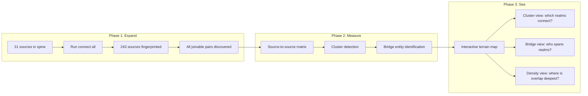

# Plan: Connection Terrain Map

## Context

The CONNECT engine (`connect/`) already exists and works. It has been run on 31 of 243 full analytical sources. The result is a healthcare-heavy graph with a few satellite clusters:

| Entity Type | Count | Sources Connected |
|-------------|-------|-------------------|
| provider | 9.6M | 7 (all CMS) |
| organization | 3.2M | 10 |
| facility | 87K | 8 |
| person | 25K | 4 |
| vessel | 9K | 2 |

Meanwhile, 23 sources have STEEL/STRONG join keys (NPI, EIN, CIK, BIOGUIDE, DOCKET, UEI) and are NOT in the spine. Another ~50+ have GEO-tier keys (FIPS, ZIP, LATLON). All of these can be connected without guessing.

The engine already supports:
- Full rebuild: `python -m connect all` (fingerprint + discover + spine + explore)
- Bulk expansion: `python -m connect harvest --connectable`
- Visualization: Plotly network graph, D3 force-directed, Mermaid ER diagrams

The gap is NOT infrastructure — it's **coverage** (only 13% of sources connected) and **interpretation** (no cluster analysis or bridge detection on top of the raw graph).

## What Gets Built



## Implementation Steps

### Step 1: Full Entity Spine Expansion

Run `python -m connect all` to re-fingerprint all 243 sources, discover all joinable pairs, and rebuild the spine with full coverage.

Expected impact:
- Currently 41K edges in CONNECT_EDGES -> should expand to 200K+ as all pairwise joins are tested
- Currently 31 sources -> 100+ sources will have at least one connection
- New entity types may emerge (FIPS-linked places, DOCKET-linked court cases, CIK-linked companies)

This is the compute-heavy step (~13 minutes based on prior runs at 1,801 sources/813 seconds). The engine already handles it.

### Step 2: Build Source-to-Source Connection Census

After the spine expands, build a summary table that answers "for every pair of sources that share entities, how many do they share?" This is the raw material for the terrain map.

Query pattern:
```sql
-- For each pair of sources: how many shared entities?
SELECT 
    a.SOURCE_TABLE AS source_a,
    b.SOURCE_TABLE AS source_b,
    a.ENTITY_TYPE,
    COUNT(DISTINCT a.ENTITY_ID) AS shared_entities
FROM ENTITY_INDEX a
JOIN ENTITY_INDEX b ON a.ENTITY_ID = b.ENTITY_ID
WHERE a.SOURCE_TABLE < b.SOURCE_TABLE  -- avoid double-counting
GROUP BY 1, 2, 3
```

Store as a materialized table `LIBRARY_META.CONNECT.SOURCE_OVERLAP_MATRIX`. This is the adjacency matrix for the graph.

### Step 3: Domain-Level Aggregation

Roll up from source-to-source to domain-to-domain using the newly populated DOMAIN_PRIMARY field from SOURCE_REGISTRY:

```sql
-- Which DOMAINS connect, and how densely?
SELECT 
    ra.DOMAIN_PRIMARY AS domain_a,
    rb.DOMAIN_PRIMARY AS domain_b,
    COUNT(DISTINCT m.ENTITY_ID) AS shared_entities,
    COUNT(DISTINCT m.source_a || m.source_b) AS source_pairs
FROM SOURCE_OVERLAP_MATRIX m
JOIN SOURCE_REGISTRY ra ON ...
JOIN SOURCE_REGISTRY rb ON ...
GROUP BY 1, 2
```

This produces the "which realms talk to each other?" matrix. Health-to-Justice? Finance-to-Government? The density numbers show which cross-domain connections are deep vs. incidental.

### Step 4: Cluster Detection

Apply community detection on the source-to-source graph. Specifically:
- Build a weighted graph (nodes=sources, edges=shared entity count)
- Run connected-components first (find islands)
- Within the main component, find dense subclusters (Louvain or label propagation)
- Name each cluster by its dominant domain

This reveals: "There are N natural realms in your data. Here they are. Here's which sources belong to each. Here's where the bridges between realms are."

### Step 5: Bridge Entity Identification

The most interesting find: entities that appear in multiple clusters. These are the actors who span worlds that normally don't see each other.

```sql
-- Entities that appear in 3+ domains
SELECT 
    ei.ENTITY_ID,
    ei.DISPLAY_LABEL,
    COUNT(DISTINCT r.DOMAIN_PRIMARY) AS domain_count,
    ARRAY_AGG(DISTINCT r.DOMAIN_PRIMARY) AS domains,
    ARRAY_AGG(DISTINCT ei.SOURCE_TABLE) AS sources
FROM ENTITY_INDEX ei
JOIN SOURCE_REGISTRY r ON UPPER(r.SOURCE_ID) = ei.SOURCE_TABLE
GROUP BY 1, 2
HAVING COUNT(DISTINCT r.DOMAIN_PRIMARY) >= 3
ORDER BY domain_count DESC
```

An organization that appears in SEC filings AND USASpending contracts AND EPA enforcement AND FEC donations — that's a 4-domain bridge entity. These are the "huh, that's interesting" pins on the map. NOT because you went looking for them. Because the topology puts them there.

### Step 6: Render the Terrain Map

Use the existing `connect/explore.py` Plotly infrastructure + extend it to show:

1. **Domain-level view** (zoomed out): nodes are domains, edges are shared-entity counts. This is the high-altitude terrain. "Health and Justice share 8,503 entities. Finance and Government Spending share 7,479."

2. **Source-level view** (zoom in on a domain): nodes are sources within a cluster, edges show how they connect.

3. **Bridge entities panel**: sorted list of entities that span the most domains. Click one to see its full cross-source footprint.

4. **Blind spots overlay**: pairs of domains that COULD connect (they have compatible key types) but DON'T (zero shared entities). These are the gaps — places where data exists on both sides but nobody's looked at the overlap.

Output: self-contained HTML file (`outputs/terrain_map.html`), interactive, opens in any browser. Based on the existing D3/Plotly patterns already in the repo.

## What This Reveals (Without Asking a Question)

The terrain map shows you:
- **Clusters** = realms of activity that are internally dense (health cluster, politics cluster, finance cluster, enforcement cluster)
- **Bridges** = the actors/entities that span multiple realms (the doctor who's also a donor who also has an EPA violation)
- **Canyons** = the blind spots where realms SHOULD connect but don't (maybe education and justice both track FIPS but nobody's ever joined them)
- **Peaks** = entities with the highest cross-realm presence (the "most interesting" things in the data, by topology alone)

You look at the map. It shows you what's there. The interesting things emerge from density and topology, not from a hypothesis.

## Verification

| Step | Check |
|------|-------|
| 1 (spine expand) | `SELECT COUNT(DISTINCT SOURCE_TABLE) FROM ENTITY_INDEX` should be 100+ (up from 31) |
| 2 (matrix) | `SELECT COUNT(*) FROM SOURCE_OVERLAP_MATRIX` should be 1000+ rows |
| 3 (domains) | Every domain pair with shared entities appears; no NULLs |
| 4 (clusters) | Each source assigned to exactly one cluster; clusters are named |
| 5 (bridges) | Bridge entities actually exist in all listed sources (spot-check 5) |
| 6 (terrain map) | HTML renders, nodes are clickable, zoom works |

## Critical Files

- [connect/__main__.py](connect/__main__.py) — CLI entry point for `python -m connect all`
- [connect/incremental.py](connect/incremental.py) — The engine that adds sources to the spine
- [connect/explore.py](connect/explore.py) — Plotly network graph renderer (extend this)
- [connect/entity_index_specs.py](connect/entity_index_specs.py) — DISPLAY_SPECS for first-class spine entities
- [connect/discover.py](connect/discover.py) — Pairwise join detection across all sources
