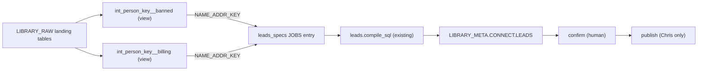

# Plan: Creative Surrogate Keys

## Context

Ripple's connect engine already has the machinery to do this — it just doesn't manufacture derived keys yet. Key findings from the codebase:

- **Detectors are config, not code.** The `JOBS` dict in [connect/leads_specs.py](c:\Code\Ripple_v6\connect\leads_specs.py) is the registry; the generic compiler `compile_sql()` in [connect/leads.py](c:\Code\Ripple_v6\connect\leads.py) turns any spec into reproducible SQL (with a `SQL_SHA256` receipt). Seven detectors exist today (`banned_but_paid`, `excluded_but_billing`, etc.).
- **The engine joins on ONE shared key column** ([connect/leads.py](c:\Code\Ripple_v6\connect\leads.py) raises if the two sides' keys differ). A name+address surrogate is two columns — so the clean move is to **pre-compute the surrogate as a single column in a dbt model**, keeping the detector pure config with zero engine edits.
- **Derived keys are an established dbt pattern.** [int_sanctioned_vessels.sql](c:\Code\Ripple_v6\library-onboarding\ripple_dbt\models\intermediate\int_sanctioned_vessels.sql) already manufactures a clean IMO; [politics__member_crosswalk.sql](c:\Code\Ripple_v6\library-onboarding\ripple_dbt\models\marts\politics\politics__member_crosswalk.sql) builds a never-null surrogate `member_key` via `coalesce()`. Intermediate models are views over `source()`.
- **Safety rails already fit.** Fuzzy/derived matches become *leads* (a `LEAD_ID`), never *facts* merged into the hard-ID spine ([connect/spine.py](c:\Code\Ripple_v6\connect\spine.py) clusters on hard IDs only). Leads flow through confirm→publish; auto-publish is structurally blocked ([connect/safety.py](c:\Code\Ripple_v6\connect\safety.py), [scripts/publish_lead.py](c:\Code\Ripple_v6\scripts\publish_lead.py)).
- **Composite keys in the GRAPH are hardcoded.** `NAME@ZIP`/`NAME@FIPS` live in an inline block in [connect/discover.py](c:\Code\Ripple_v6\connect\discover.py) (`_build_keysets()`); there is no config list. Generalizing graph-level surrogate keys means refactoring that block — deferred to phase 2.

## Approach

Do NOT build a generic surrogate-key engine up front (over-engineering). Prove the concept with ONE surrogate key, end to end, using the config path, then generalize only if it pays off.

**MVP play: "banned provider reappears under a new NPI."** An OIG-excluded provider re-registers with a fresh NPI but the same name+address. The hard ID deliberately won't match — so we manufacture a person-key from name+address to catch them. This extends the proven `banned_but_paid` shape, is the literal name+address surrogate, and has a clear "who gets hurt" (patients, Medicare).

## Implementation steps

### 1. Feasibility spike (read-only, do first)
Before building anything, prove signal exists. Query the banned-providers source (OIG LEIE) and the active-billing source (Open Payments / Medicare billing) and count: how many `normalize(name) + normalize(address/zip)` surrogate keys appear on BOTH sides where the NPI differs or is absent. If near-zero, stop — the play is dead. If meaningful, proceed. Also eyeball whether common-name + big-facility-address collisions will dominate (the false-positive risk).

### 2. Build the surrogate-key intermediate models
Create two views under [library-onboarding/ripple_dbt/models/intermediate/](c:\Code\Ripple_v6\library-onboarding\ripple_dbt\models\intermediate), following the `int_sanctioned_vessels.sql` pattern (`materialized='view'`, `source()` refs, header comment documenting the key recipe and its trap):
- `int_person_key__banned.sql` — banned/excluded providers with a computed `NAME_ADDR_KEY` (e.g. `normalized_last || '|' || normalized_first || '|' || zip5`), carrying exclusion type/date.
- `int_person_key__billing.sql` — active-billing providers with the same `NAME_ADDR_KEY` recipe, carrying payer/amount/year.
Reuse the normalization already in [connect/keys.py](c:\Code\Ripple_v6\connect\keys.py) (`NORM_RULES`, `normalize_sql`) so the surrogate key is built the same way the engine builds other keys — or add a `NAME_ADDR` normalizer there if none fits.

### 3. Add the detector (pure config, zero engine code)
Add one dict to the `JOBS` registry in [connect/leads_specs.py](c:\Code\Ripple_v6\connect\leads_specs.py), keyed on `NAME_ADDR_KEY`, following the `banned_but_paid` template:
- `left` = `int_person_key__banned`, `right` = `int_person_key__billing`
- `require_surname: True` and a scoring block (`name_w`, `breadth_w`) to suppress weak matches
- `no_fanout_guard: True`
- A `title_template` that states it is a *possible* re-registration (lead language, not a verdict).

### 4. Wire the Reading-Room headline
Add a `WHEN '<new_rule>'` branch to the enrichment/headline `CASE` in [lead_queue.sql](c:\Code\Ripple_v6\library-onboarding\ripple_dbt\models\marts\review\lead_queue.sql) and its yaml, so the lead renders with a real headline in the browse layer.

### 5. Run, QA for false positives, tune
Dry-run (`python -m connect leads --job <new>`), inspect the compiled SQL, then run it. Count leads produced and hand-check the top ~15: are the name+address matches actually the same human, or common-name collisions at shared addresses? Tighten the key recipe / scoring / `require_surname` until precision looks defensible. This is the calibration step — treat it as green-lane iteration.

### 6. Walk ONE lead through review (stop before publish)
Confirm a single lead via the review CLI (`python -m connect review --kind lead --id LEAD_xxx --decision confirmed`). Do NOT publish — publishing is Chris's red-lane call. This proves the full loop up to the human gate.

### 7. (Phase 2, only if MVP pays off) Generalize
- Refactor the hardcoded composite block in [connect/discover.py](c:\Code\Ripple_v6\connect\discover.py) `_build_keysets()` into a `COMPOSITE_KEYS` config list (mirroring the single-key `KEY_TOKENS`/`NORM_RULES`/`KEY_DOMAIN` triad) so graph-level surrogate keys like `NAME@YEAR` become pluggable.
- Register derived keys durably in `LIBRARY_META.REGISTRY.SOURCE_REGISTRY.JOIN_KEYS_STD` (the backfill script can't auto-measure derived keys — this is a known gap to design around).
- Build the other tricks as they earn it: geo+time population bridge (pharma$ → overdose by county+year), address-as-entity (PPP shell detection), event/gap (AIS dark near sanctioned port).

## Verification

- **Feasibility:** the spike query returns a meaningful, non-trivial overlap count with a plausible false-positive rate.
- **dbt:** `dbt build --select int_person_key__banned int_person_key__billing` succeeds; row counts and `NAME_ADDR_KEY` cardinality are sane (not all-null, not all-collapsed).
- **Detector dry-run:** compiled SQL inspects clean; produces leads with all required columns (`LEAD_ID, RULE_NAME, LEFT_KEY_TYPE, LEFT_KEY_VALUE, TITLE, SCORE, EVIDENCE, RUN_ID` + receipt columns).
- **Precision check:** top ~15 leads manually verified as real same-person matches, not collisions.
- **Receipts intact:** existing detector `SQL_SHA256` tests still pass ([tests/test_leads_wave2.py](c:\Code\Ripple_v6\tests\test_leads_wave2.py)) — the new spec must not change any existing spec's compiled SQL.
- **Loop closes:** one lead reaches `confirmed` in `LIBRARY_META.REVIEW.DECISIONS`; none auto-publish.

## Critical Files

- [connect/leads_specs.py](c:\Code\Ripple_v6\connect\leads_specs.py) - the `JOBS` detector registry; the new detector is one dict here
- [connect/leads.py](c:\Code\Ripple_v6\connect\leads.py) - the generic compiler; MVP touches it zero, phase-2 multi-column joins would edit `compile_sql()`
- [library-onboarding/ripple_dbt/models/intermediate/int_sanctioned_vessels.sql](c:\Code\Ripple_v6\library-onboarding\ripple_dbt\models\intermediate\int_sanctioned_vessels.sql) - the derived-key model template to copy
- [connect/keys.py](c:\Code\Ripple_v6\connect\keys.py) - `NORM_RULES`/`normalize_sql`, reuse for consistent surrogate-key normalization
- [connect/discover.py](c:\Code\Ripple_v6\connect\discover.py) - hardcoded composite-key block (`_build_keysets()`); phase-2 refactor target for graph-level surrogate keys
- [connect/safety.py](c:\Code\Ripple_v6\connect\safety.py) - the fact-vs-lead / publish firewall the new matches must route through