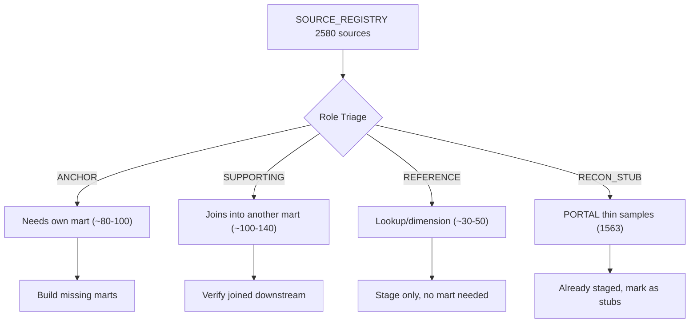

# Plan: Data Organization to A-Grade

## Context

The current state assessed against six dimensions:

| Dimension | Current | Problem |
|-----------|---------|---------|
| Domain classification | D | 995/1815 sources tagged UNCLASSIFIED |
| Mart coverage | D+ | 58 marts from 1,017 staging views (5.7%) |
| Staging coverage | B- | 134 non-PORTAL sources have no staging view |
| Test coverage | C+ | ~51 of 58 marts have no test YAML |
| Pipeline reliability | C | 12/58 marts disabled (all have 1-9 rows = broken ingest) |
| Redundancy | B+ | Open Payments 4-table pileup (~44M redundant rows) |

The core insight: **the denominator is wrong.** Not every source needs a mart. 1,563 PORTAL stubs are recon samples, not analytical sources. Many of the 243 full loads are reference/dimension tables that JOIN into other marts rather than standing alone. The plan fixes both the numerator (build what's missing) and the denominator (classify what counts).

## The Strategy: Triage First, Build Second



Once sources have roles, the coverage metrics become honest:
- Mart coverage = ANCHOR sources with a mart / total ANCHOR sources
- Staging coverage = all non-RECON_STUB sources with staging / total non-RECON_STUB

## Implementation Steps

### Step 1: Add SOURCE_ROLE to SOURCE_REGISTRY

Add column `SOURCE_ROLE` with values:
- **ANCHOR** — standalone analytical source that warrants its own mart (grain-defined, question-answering)
- **SUPPORTING** — joins into an anchor's mart (e.g., a crosswalk, a secondary dimension)
- **REFERENCE** — static lookup (geography, codes, calendars)
- **RECON_STUB** — PORTAL_* thin sample used only for join-key discovery

Initial population logic:
- All `PORTAL_*` tables = `RECON_STUB`
- All tables already backing a mart = `ANCHOR`
- Tables with < 100 rows that aren't already modeled = `REFERENCE`
- Remainder = triage manually (Chris decides on ambiguous ones)

### Step 2: Batch-Classify 995 UNCLASSIFIED Domains

Pattern inference from source names:

| Pattern | Domain |
|---------|--------|
| FED_CDC_*, FED_CMS_*, FED_FDA_*, FED_HRSA_*, FED_VA_* | health_medicine |
| FED_FEC_*, FED_MEDSL_* | money_in_politics |
| FED_SEC_*, FED_FDIC_*, FED_FFIEC_*, FED_NCUA_*, FED_PBGC_* | money_finance |
| FED_BLS_*, FED_SBA_*, FED_USITC_* | economy_labor_trade |
| FED_DOJ_*, FED_BOP_*, FED_USCOURTS_*, FED_EOIR_* | justice_courts |
| FED_EPA_*, FED_USGS_*, XC_OWID_CO2, XC_OWID_FOSSIL_* | energy_environment |
| FED_DOT_*, FED_FAA_*, FED_NHTSA_*, FED_NOAA_* | transport_movement |
| FED_ICE_*, FED_USCIS_*, FED_CBP_*, FED_EOIR_* | immigration_migration |
| FED_ED_*, FED_NSF_* | education |
| INTL_* | (infer from suffix or mark for manual review) |
| PORTAL_* | open_data_portal |

This handles ~70% mechanically. The remaining ~30% (especially INTL_* and XC_*) gets a manual pass.

### Step 3: Generate Staging Models for 134 Unstaged Sources

Use the existing `scripts/generate_staging_models.py` pattern:
- One directory per source under `models/staging/`
- Standard generated SQL: SELECT columns, snake_case rename, QUALIFY ROW_NUMBER dedup
- Standard `schema.yml` with source declaration + unique/not_null on natural key

Priority order by row count (big tables first — they're most likely to matter):
1. FED_FEC_INDIV_CONTRIBUTIONS (84M) — already staged? (check — it's the mart's source)
2. FED_USASPENDING_CONTRACTS_FULL (20M)
3. FED_USASPENDING_ASSISTANCE_FULL (19.9M)
4. FED_CMS_PARTD_PRESCRIBER_DRUG (25.9M)
5. FED_BLS_QCEW (3.6M)
6. FED_SBA_LOANS (2.2M)
7. ... remainder in descending row count

### Step 4: Fix or Retire 12 Disabled Marts

All 12 have 1-9 rows in `_RESTORE_20260701`. These are clearly broken ingests where the loader grabbed headers or a single test row. For each:

1. Check if the source API/URL still works
2. If yes: re-ingest properly, re-enable the mart
3. If no: move source table to RETIRED schema, mark `INCLUDE = 'N'` in registry, delete the disabled dbt model

Candidates most likely fixable (the source data exists publicly):
- `JUSTICE__FED_FJC_IDB` — Federal Judicial Center (reliable API)
- `REGULATION__FED_FDIC_ENFORCEMENT` — FDIC enforcement actions (public)
- `CORPORATE_REGISTRY__INTL_IE_CRO` — Irish company register (public)
- `ECONOMICS__FED_HHS_TAGGS` — HHS grants (public)

### Step 5: Build Marts for High-Value Unmodeled Sources

The following sources are large, analytically rich, and clearly warrant their own mart:

| Source | Rows | Domain | Mart Name |
|--------|------|--------|-----------|
| FED_CMS_PARTD_PRESCRIBER_DRUG | 25.9M | health | health__fed_cms_partd_prescribers |
| FED_BLS_QCEW | 3.6M | economy | economics__fed_bls_qcew |
| FED_SBA_LOANS | 2.2M | economy | economics__fed_sba_loans |
| FED_CMS_NADAC | 1.5M | health | health__fed_cms_nadac |
| FED_SBA_PPP | 968K | economy | economics__fed_sba_ppp |
| FED_CFPB_HMDA | 28K | housing | housing__fed_cfpb_hmda |
| FED_DEA_ARCOS | 409 | health | health__fed_dea_arcos |
| FED_CDC_OVERDOSE | 84K | health | health__fed_cdc_overdose |
| FED_SEC_EDGAR_INSIDERS | 69K | money | money__fed_sec_insider_trades |
| FED_FDIC_BANK_DATA | 10K | money | money__fed_fdic_banks |

Each mart requires: grain definition, natural key, defensive casting, header comment, and at minimum LEFT JOINs to core dimensions (DIM_STATE, DIM_DATE).

Additional candidates from the already-staged-but-no-mart pool (~761 staging views without a downstream mart) would be triaged by SOURCE_ROLE — only ANCHOR-tagged ones need marts.

### Step 6: Add Test YAML for Untested Marts

For each of the ~51 marts without a schema YAML:

```yaml
# models/marts/{domain}/schema_{mart_name}.yml
version: 2
models:
  - name: {mart_name}
    description: ...
    columns:
      - name: {primary_key}
        tests:
          - unique
          - not_null
      - name: {enum_column}
        tests:
          - accepted_values:
              values: [...]
      - name: {fk_column}
        tests:
          - relationships:
              to: ref('{parent_model}')
              field: {parent_key}
```

Minimum per mart: unique + not_null on grain key. Add accepted_values and relationships where the mart has obvious enum columns or FK joins.

### Step 7: Resolve Open Payments Redundancy

Current state:
- `FED_CMS_OPEN_PAYMENTS` (15.4M rows)
- `FED_CMS_OPEN_PAYMENTS_GNRL` (15.4M rows) — likely same data
- `FED_CMS_OPEN_PAYMENTS_2022` (13.3M)
- `FED_CMS_OPEN_PAYMENTS_2023` (14.7M)

The intermediate model `int_open_payments_all_years` unions the year tables. Actions:
1. Confirm `OPEN_PAYMENTS` and `OPEN_PAYMENTS_GNRL` are duplicates (compare row hashes or RECORD_IDs)
2. Retire the duplicate to RETIRED schema
3. Ensure the intermediate correctly covers all years
4. Mark retired table's registry entry as `INCLUDE = 'N'`

### Step 8: Reclassify PORTAL Stubs

Update SOURCE_REGISTRY for all 1,563 PORTAL_* entries:
- `SOURCE_ROLE = 'RECON_STUB'`
- `DOMAIN_PRIMARY = 'open_data_portal'` (if not already set)

Update `V_STATE` or any summary views to report two counts:
- "Full analytical sources: 243"
- "Recon stubs: 1,563"

This makes the metrics honest without deleting anything.

## Verification

After each step:

| Step | Verification |
|------|-------------|
| 1 (roles) | `SELECT SOURCE_ROLE, COUNT(*) FROM SOURCE_REGISTRY GROUP BY 1` — no NULLs |
| 2 (domains) | `SELECT COUNT(*) FROM SOURCE_REGISTRY WHERE DOMAIN_PRIMARY = 'UNCLASSIFIED'` = 0 |
| 3 (staging) | `dbt run --select tag:spine_generated` succeeds; view count matches |
| 4 (disabled) | No models with `+enabled: false` in dbt_project.yml; `_RESTORE` schema dropped |
| 5 (marts) | `dbt run --select {new_mart}`; row counts > 0; THE_LIBRARY views resolve |
| 6 (tests) | `dbt test` passes on all 58 marts |
| 7 (redundancy) | Only one base Open Payments table in LANDING; intermediate covers all years |
| 8 (stubs) | V_STATE shows clean split between analytical sources and recon stubs |

## Post-Plan Scorecard Target

| Dimension | Before | After | Why |
|-----------|--------|-------|-----|
| Domain classification | D | A | 0 UNCLASSIFIED remaining |
| Mart coverage | D+ | A | Measured against ANCHOR sources only; all anchors have marts |
| Staging coverage | B- | A | All 243 non-PORTAL sources staged |
| Test coverage | C+ | A | All marts have schema.yml with grain + FK + enum tests |
| Pipeline reliability | C | A | 0 disabled marts; broken ones fixed or retired |
| Redundancy | B+ | A | Open Payments resolved; PORTAL classified honestly |

## Critical Files

- `library-onboarding/ripple_dbt/dbt_project.yml` — disabled model list, materialization config
- `library-onboarding/ripple_dbt/models/staging/` — where 134 new staging models go
- `library-onboarding/ripple_dbt/models/marts/` — where new mart models go
- `scripts/generate_staging_models.py` — the generator for batch staging model creation
- `infra/ddl/01_meta_base_tables.sql` — SOURCE_REGISTRY DDL (add SOURCE_ROLE column)
