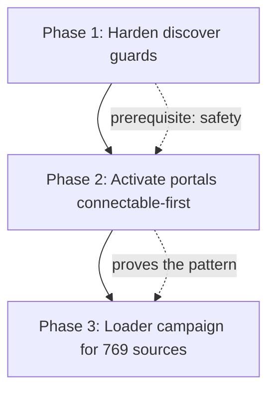

# Comprehensive Data Coverage Expansion

## Context

Ripple currently connects only **242 of 1,805 loaded tables** (13%), and only **242 of 2,574 cataloged sources** (9%). The gap is three distinct problems, each with a different fix and risk profile:

| Layer | Count | Status | Blocker |
|-------|-------|--------|---------|
| Core tables (connected) | 105 | In graph | — |
| Core tables (dark) | 137 | Loaded, no shared IDs | Structural (need blocking/LSH) |
| Portal tables | 1,563 | Loaded, **ignored** | One filter: `fingerprint.py:38` |
| Cataloged, unloaded | 769 | Registry only | No loader written |
| Portal universe | 338,520 | Indexed only | Capacity/selection |

**Key findings from code exploration:**

1. **Portal exclusion is one line.** [connect/fingerprint.py:38](connect/fingerprint.py) has `AND TABLE_NAME NOT LIKE 'PORTAL_%%'`. discover.py inherits the table list from fingerprint's JSON output — it has no PORTAL logic of its own. Removing/narrowing that filter is the entire activation mechanism.

2. **The discover self-join is uncapped and NAME is ungated.** The value self-join at [connect/discover.py:366-374](connect/discover.py) has no pair cap. `ZIP` is protected by collision math (`KEY_DOMAIN=10^5`), but plain `NAME` has no `KEY_DOMAIN` entry, so it passes at low confidence (~0.2-0.3) for any `matched >= 5`. Including 1,563 NAME/ZIP-heavy portal tables would flood low-confidence NAME edges AND risk an N-squared blowup on hot ZIP values. **These two gaps must be fixed before activation, or the graph fills with junk.**

3. **The portal loader already has a connectable-first mode.** [connect/portal_loader.py](connect/portal_loader.py) `connectable_candidates()` (line 114) only selects datasets carrying an ENTITY key, ordered by `hits_live DESC` (shares a key with data you already hold). It registers into SOURCE_REGISTRY and has a `--verify` post-load connection check.

4. **New sources are specs, not scripts.** [scripts/server_side_load.py](scripts/server_side_load.py) is fully spec-driven — a new bulk/API/CSV/zip/json source is a dict appended to [scripts/server_side_specs.py](scripts/server_side_specs.py) `SPECS`, routed through staging + atomic SWAP. Only ~132 "portal-only" and a handful of scrape/subscription sources genuinely need custom work; the ~600 bulk/API sources are spec-able.

**Chosen strategy (lowest-risk):** Connectable-first (only ingest/activate tables with hard IDs or proven links — near-zero junk) + activate-before-load (start with data already in Snowflake — no download failures).

---

## Phase 1 — Harden the discover engine (SAFETY PREREQUISITE)

These are the guards from the QA audit that make everything downstream safe. Do these first; they have zero coverage impact but prevent the junk flood.

### Step 1.1 — Cap the value self-join fanout
In [connect/discover.py:366-374](connect/discover.py), the `(key,val)` self-join has no ceiling. Add a per-value fanout guard so a single hot ZIP shared across 1,500 tables can't emit ~1M pairs. Options: a `QUALIFY ROW_NUMBER()` cap per value, or exclude values whose cross-table frequency exceeds a threshold (a "stopword" list for over-common ZIPs).

### Step 1.2 — Gate plain NAME
Give `NAME` a `KEY_DOMAIN` entry (so collision math applies) OR require the `NAME@ZIP` composite and stop emitting bare-NAME edges. Bare NAME is the single biggest junk source at scale. Recommendation: require composite; bare NAME alone is never trustworthy.

### Step 1.3 — Verify with current 242 tables
Re-run `python -m connect discover` and confirm edge count stays ~1,506 (the guards shouldn't drop legitimate edges). Diff the tier breakdown against the committed baseline.

---

## Phase 2 — Activate the 1,563 portal tables (connectable-first)

### Step 2.1 — Narrow the fingerprint filter instead of removing it
Change [connect/fingerprint.py:38](connect/fingerprint.py) from a blanket `NOT LIKE 'PORTAL_%%'` exclusion to a **connectable allowlist**: include a PORTAL table only if it carries a STEEL/STRONG entity key (EIN/NPI/UEI/CIK/etc.). This brings in the portal tables that can actually link and leaves the NAME/ZIP-only city scrapes out. Reuse the `ENTITY_KEYS` list from [connect/keys.py](connect/keys.py) that `portal_loader.connectable_candidates()` already uses.

### Step 2.2 — Re-run the pipeline
`python -m connect fingerprint` then `discover`. Measure: how many portal tables now carry live hard IDs, how many new edges, what tier mix. Expect a modest, high-quality bump (portal tables with real EINs/NPIs), not a flood.

### Step 2.3 — Rebuild spine + re-pin incremental
`python -m connect spine`, `python -m connect.incremental seed`, `validate`. Confirm the new portal entities merge cleanly into the spine.

### Step 2.4 — Regenerate terrain map + review
`python scripts/build_terrain_map.py`. Verify coverage numbers rise and the new connections are defensible (spot-check 3 new portal edges against source tables, same method Fable used).

---

## Phase 3 — Loader campaign for the 769 cataloged sources

Prioritized, spec-driven, Tier-1 first. This is the long pole but it's incremental and each source is independently verifiable.

### Step 3.1 — Triage the 769 by access method
Query SOURCE_REGISTRY for the unloaded sources grouped by `ACCESS_METHOD` and `PRIORITY_TIER`. Split into:
- **Spec-able now** (~600: API, bulk download, CSV/zip/json) → append dicts to `server_side_specs.py`
- **Portal-only** (~132) → route through `portal_loader.py` connectable mode
- **Hard** (scrape, subscription, paid) → defer, document

### Step 3.2 — Batch the Tier-1 spec-able sources
379 Tier-1 sources exist. Write specs in batches of ~10, run `python scripts/server_side_load.py --spec <id> --run` per source, verify each lands with real rows (density gate already guards empty loads). Prioritize sources whose `JOIN_KEYS_STD` include hard IDs — those connect immediately.

### Step 3.3 — Re-discover incrementally after each batch
Use the incremental engine (`connect connect-one <source>`) rather than full rebuilds, so each new source's edges appear without a 30-min spine rebuild. Full `spine` + `seed` at the end of each batch.

### Step 3.4 — Track coverage as a metric
After each batch, log connected-table count and edge count to a coverage ledger so progress is visible and regressions are caught.

---

## Verification

- **Phase 1:** `python -m connect discover` on the current 242 tables produces ~1,506 edges (no legitimate edges lost); a synthetic test where 1,500 fake tables share one ZIP produces a bounded pair count, not a blowup. Add the missing `confidence()` unit test the audit flagged (would pin NAME gating + fanout).
- **Phase 2:** New portal edges spot-checked against source tables (stored MATCHED == recomputed). `connect.incremental validate` all PASS after spine rebuild. Terrain map coverage rises with zero low-confidence NAME junk in the top connections.
- **Phase 3:** Each loaded source passes the density gate (non-empty) and appears in SOURCE_REGISTRY; `pytest -q -m "not snowflake"` stays green; coverage ledger shows monotonic increase.
- **Global:** No regression in the 480 passing tests at any phase.

---

## Critical Files

- [connect/fingerprint.py](connect/fingerprint.py) — line 38 filter is the portal activation switch (Phase 2)
- [connect/discover.py](connect/discover.py) — self-join fanout cap + NAME gating (Phase 1); confidence() at line 102
- [connect/keys.py](connect/keys.py) — `ENTITY_KEYS` / `KEY_DOMAIN` — where NAME gating and the connectable allowlist are defined
- [connect/portal_loader.py](connect/portal_loader.py) — `connectable_candidates()` already implements connectable-first selection (Phase 2/3)
- [scripts/server_side_specs.py](scripts/server_side_specs.py) — append specs here for the 769-source campaign (Phase 3)

## Risk Notes

- **Phase 1 is the safety gate.** Do not activate portals (Phase 2) before the fanout cap and NAME gate are in and tested — that ordering is the whole point of "lowest risk."
- Each phase is independently revertible: Phase 2 is one filter, Phase 3 sources are individual specs with atomic SWAP (a failed load never corrupts a live table).
- Compute: Phase 2/3 grow discover runtime. Watch RIPPLE_WH credit burn; the staged reconcile (already committed) keeps timeouts bounded.
