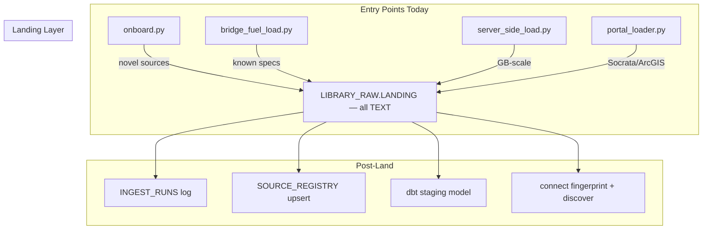
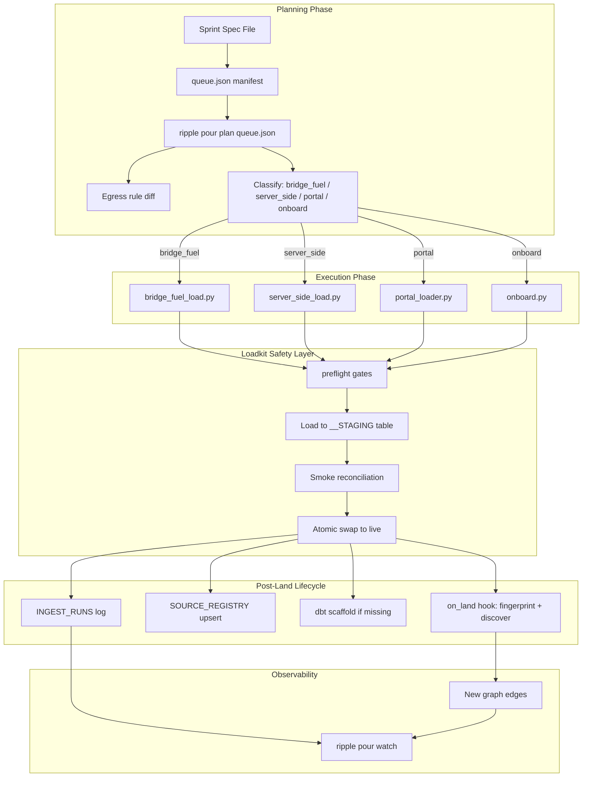

# Plan: Full Pour Architecture

## Context

The Ripple platform already has a well-engineered but **fragmented** loading pipeline — three loader tiers (LLM onboarding agent, deterministic bridge\_fuel, server-side bulk), each with their own spec format and invocation path. The connection engine auto-wires tables via key detection once data lands. The goal is to unify these into one coherent flow that any dataset from the 35-item pour plan can follow without custom plumbing.

### Existing Infrastructure (what we're building on top of)



**Key findings:**

- All loaders converge on the same target (`LIBRARY_RAW.LANDING`), provenance stamps (`_INGESTED_AT`, `_SOURCE_RUN_ID`, `_SRC_SHA256`), and INGEST\_RUNS logging.
- `loadkit/` provides shared safety: atomic swap, preflight gates, smoke reconciliation, windowed/chunked loading.
- `ripple pour plan/run` already routes between deterministic vs LLM paths but doesn't yet handle server-side or multi-sprint orchestration.
- The connection engine runs incrementally (via heartbeat LINK tier) but there's no on-land hook that triggers it immediately.
- Each loader tier has its own spec file format — similar but not identical dict shapes.

---

## Implementation Steps

### Step 1: Define Universal Spec Schema and Queue Format

**Problem:** `bridge_fuel_specs.py`, `server_side_specs.py`, and `backfill_specs.py` use overlapping but inconsistent dict shapes. Adding 35 sources means we need one canonical format.

**Design:**

Create `loadkit/spec_schema.py` — a dataclass (or TypedDict) that defines the universal spec:

```python
@dataclass
class PourSpec:
    # Identity (required)
    source_id: str                    # e.g. "FED_FEC_LEADERSHIP_PAC"
    name: str                         # human-readable
    publisher: str

    # Acquisition (required)
    download_url: str                 # or url + resolver for rotating links
    kind: str = "csv"                 # csv | zip | zip_csv | json | xml
    
    # Routing (determines which loader tier runs it)
    loader: str = "bridge_fuel"       # bridge_fuel | server_side | portal | onboard
    
    # CSV options
    delimiter: str = ","
    encoding: str = "utf-8"
    has_header: bool = True
    member_pattern: str = ""          # for zips: regex to pick the member
    
    # Scale control
    chunked: bool = False
    chunk_rows: int = 500_000
    
    # Key columns (what connects this to the graph)
    key_cols: list[dict] = field(default_factory=list)  # [{"col": "src_name", "as": "CANONICAL"}]
    join_keys: str = ""               # comma-separated canonical keys for registry

    # Resolver (for rotating download links)
    resolver: dict | None = None
    
    # Registry metadata
    category: str = ""
    subcategory: str = ""
    unit_of_observation: str = ""
    update_cadence: str = ""
    accountability_relevance: str = ""
    priority_tier: str = "2"
    
    # Optional
    csv_opts: dict = field(default_factory=dict)
    filter: Callable | None = None    # row-filter applied before load
    smoke_referee: dict | None = None # reconciliation spec
    notes: str = ""
```

**Queue manifest** (`queues/sprint_a.json`):

```json
{
  "sprint": "A",
  "created": "2026-07-27",
  "sources": [
    {"source_id": "FED_FEC_LEADERSHIP_PAC", "spec_file": "sprint_a_specs.py"},
    {"source_id": "XC_HOUSESTOCKWATCHER", "spec_file": "sprint_a_specs.py"},
    ...
  ]
}
```

**Files to create/modify:**

- loadkit/spec\_schema.py — new: canonical spec dataclass + validation
- scripts/sprint\_a\_specs.py — new: Sprint A specs following the schema
- queues/sprint\_a.json — new: queue manifest

---

### Step 2: Unify Loader Dispatch in `ripple pour`

**Problem:** `pour.py` currently routes binary (deterministic vs LLM). It doesn't know about server-side or portal paths. Adding a `loader` field to specs lets the router dispatch to the right backend.

**Design:** Extend `pour.py`'s classifier and executor:

```python
def classify_source(entry: dict, known_specs: dict[str, PourSpec]) -> str:
    """Returns: 'bridge_fuel' | 'server_side' | 'portal' | 'onboard'"""
    spec = known_specs.get(entry["source_id"])
    if spec:
        return spec.loader
    if any(tok in entry.get("url", "") for tok in PORTAL_TOKENS):
        return "portal"
    return "onboard"  # fallback: LLM agent handles novel sources
```

The executor then dispatches:

- `bridge_fuel` → `bridge_fuel_load.py` (existing)
- `server_side` → `server_side_load.py` (existing)
- `portal` → `connect/portal_loader.py` (existing)
- `onboard` → `library-onboarding/onboard.py` (existing)

All four paths already converge on the same post-load lifecycle (INGEST\_RUNS, SOURCE\_REGISTRY). The router just needs to call the right one.

**Files to modify:**

- ripple/pour.py — extend classifier + executor for 4-way routing
- ripple/common.py — add spec-loading helpers if needed

---

### Step 3: Egress Rule Management

**Problem:** Server-side loads require the download host to be listed in `RIPPLE_BULK_EGRESS`. Currently manual SQL. With 35 new sources, this becomes a per-sprint chore.

**Design:** Add `loadkit/egress.py`:

- Parses all spec URLs (including resolver URLs) to extract hostnames
- Queries `SHOW NETWORK RULES` to get current allowlist
- Diffs → prints the `ALTER NETWORK RULE` statement needed (or executes with `--apply`)
- Integrated into `ripple pour plan` output: "These hosts need egress: \[...]"

**Files to create/modify:**

- loadkit/egress.py — new: egress diff + patch utility
- ripple/pour.py — integrate egress check into `pour plan`

---

### Step 4: Automate dbt Staging Scaffold Post-Load

**Problem:** `onboard.py` scaffolds dbt models automatically (checkpoint 4). `bridge_fuel_load.py` doesn't — it's LLM-free. This means deterministic loads require a manual `scaffold_dbt.py` call or hand-written models.

**Design:** Extract `library-onboarding/scaffold_dbt.py`'s logic into a reusable function that any loader can call post-swap:

```python
def scaffold_if_missing(source_id: str, table_name: str, conn) -> str | None:
    """Generate stg_<source>__<entity>.sql + schema.yml if they don't exist.
    Returns path of created model or None if already exists."""
    model_dir = DBT_ROOT / "models" / "staging" / source_id
    if model_dir.exists():
        return None  # already scaffolded
    # DESCRIBE TABLE -> column list
    # Generate schema.yml (source declaration)
    # Generate stg model (SELECT with type casts based on column names)
    # Apply key_cols renames from spec
```

The scaffold follows the existing pattern exactly:

- Source points at `LIBRARY_RAW.LANDING.<TABLE>`
- Model is a view in `LIBRARY_STAGING`
- Key columns get `unique` + `not_null` tests
- Dedup via `QUALIFY ROW_NUMBER() OVER (PARTITION BY <key> ORDER BY _INGESTED_AT DESC) = 1`

**Files to modify:**

- library-onboarding/scaffold\_dbt.py — refactor core logic into importable function
- scripts/bridge\_fuel\_load.py — call scaffold post-swap
- scripts/server\_side\_load.py — call scaffold post-swap

---

### Step 5: Wire Connection Engine Auto-Link on Land

**Problem:** The connection engine runs on a 6-hour heartbeat cadence (LINK tier). A freshly landed table doesn't appear in the graph until the next heartbeat tick. For sprint pours (5+ sources landing in sequence), this means the graph is always stale during the pour.

**Design:** Add an on-land hook that triggers incremental fingerprint + discover for just the landed table:

```python
# In the shared post-load lifecycle (after atomic swap + registry upsert):
def on_land_hook(source_id: str, table_name: str):
    """Trigger incremental connection engine for one table."""
    # 1. Fingerprint just this table (fast: single DESCRIBE + sample query)
    # 2. Upsert its keys into KEYSET_LIVE
    # 3. Run discover for edges involving this table only
    # 4. If new edges found, update CONNECT_EDGES_INC
```

This mirrors what `connect connect-changed` does but scoped to one table. The weekly RECONCILE tier remains the full-rebuild backstop.

**Files to create/modify:**

- connect/on\_land.py — new: single-table fingerprint + edge discovery
- loadkit/lifecycle.py — new: shared post-load lifecycle (log, register, scaffold, connect)
- All loaders call `lifecycle.on_success(...)` instead of each doing their own log+register

---

### Step 6: Sprint A Manifest and Specs

Write the actual specs for the first five datasets, proving the end-to-end flow:

| # | Source                      | Loader                                     | Key columns  | Size       |
| - | --------------------------- | ------------------------------------------ | ------------ | ---------- |
| 1 | FEC Leadership PAC sponsors | bridge\_fuel                               | FEC\_ID      | \~5K rows  |
| 2 | Housestockwatcher STOCK Act | bridge\_fuel                               | BIOGUIDE     | \~30K rows |
| 3 | IRS 990 e-file index        | server\_side                               | EIN          | \~3M rows  |
| 4 | EPA FRS uncap               | server\_side (re-run existing, remove cap) | FRS\_ID, EIN | \~4M rows  |
| 5 | SEC Form 3/4/5 insider txns | server\_side                               | CIK          | \~5M rows  |

For each: verify the download URL is live, confirm the key column names match what the connect engine's `KEY_TOKENS` will detect, and write the spec dict.

**Files to create:**

- scripts/sprint\_a\_specs.py — five specs following the universal schema
- queues/sprint\_a.json — the queue manifest

---

### Step 7: Observability — Pour Dashboard and Alerts

**Problem:** With multi-source sprints, Chris needs a single view of: what landed, what failed, what's now connected. Currently this requires checking INGEST\_RUNS manually.

**Design:** Extend `ripple pour watch` to show sprint-level progress:

```
Sprint A progress (5 sources):
  [DONE]  FED_FEC_LEADERSHIP_PAC    5,012 rows   2 edges gained (FEC_ID)
  [DONE]  XC_HOUSESTOCKWATCHER     28,431 rows   4 edges gained (BIOGUIDE)
  [RUN]   FED_IRS_990_INDEX              ...      loading (server-side)
  [WAIT]  FED_EPA_FRS_FULL               ...      queued
  [WAIT]  FED_SEC_INSIDER_TXN            ...      queued
```

And add a post-sprint summary to the heartbeat nag: if a sprint completed, show total rows landed + new graph edges.

**Files to modify:**

- ripple/pour.py — extend `watch` for sprint-level view
- scripts/heartbeat.py — add sprint completion summary to nag output

---

## The Full Lifecycle (after all steps)



---

## Verification

After implementation, verify the architecture works end-to-end:

1. **Unit tests:** spec validation rejects bad specs; classifier routes correctly; scaffold generates valid dbt SQL
2. **Dry run:** `ripple pour plan queues/sprint_a.json` shows correct routing, egress diff, and no blockers
3. **Single source:** Run one small source (FEC Leadership PAC, \~5K rows) through the full lifecycle and verify: lands in LIBRARY\_RAW\.LANDING, INGEST\_RUNS logged, SOURCE\_REGISTRY updated, dbt model scaffolded, connection engine finds FEC\_ID edges
4. **dbt build:** `dbt build --select stg_fed_fec_leadership_pac` succeeds
5. **Graph check:** `connect status` shows the new table with edges

---

## Critical Files

- ripple/pour.py — The router/orchestrator to extend with 4-way dispatch
- loadkit/atomic\_load.py — The atomic swap pattern all loaders use
- scripts/bridge\_fuel\_specs.py — Existing spec format to generalize
- connect/incremental.py — Incremental engine to hook into post-land
- library-onboarding/scaffold\_dbt.py — Scaffold logic to extract and reuse
