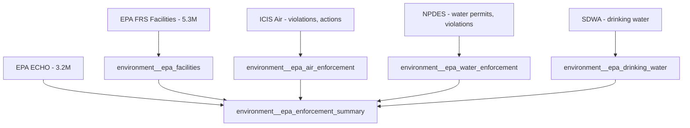

# Plan: Mass Mart Buildout

## Context

### What exists now
- **1,951 raw tables** in `LIBRARY_RAW.LANDING` (625M total rows across 1,815 successful loads)
- **~900+ staging models** (mostly `spine_generated` — columns renamed to snake_case, deduped, but everything remains TEXT)
- **63 mart models** built (7% coverage)
- Only **8 tables** have the C-numbered column problem (FEC: PAC_SUMMARY, COMMITTEES, CANDIDATES, CAND_CMTE_LINKAGE; NHTSA: COMPLAINTS, RECALLS, INVESTIGATIONS; plus one more)
- **1,943 tables** have proper column names and are structurally ready for staging/mart promotion

### Staging quality tiers (revised from first pass)

| Tier | Count | State | Work needed |
|------|-------|-------|-------------|
| Hand-crafted (OFAC, politics) | ~10 | Typed, cleaned, deduped | Mart only |
| Spine-generated with entity ID | ~50+ | Deduped, `spine_entity_id` present, all TEXT | Type casts in staging + thin mart |
| Spine-generated, no entity ID | ~800+ | Deduped, no entity link, all TEXT | Determine entity type + type casts + mart |
| Minimal staging (proper columns) | ~80 | No dedup, grain ambiguous, all TEXT | Profile grain + dedup + type casts + mart |
| Minimal staging (C-numbered) | 7 | No column names, no grain, no dedup | Map columns from data dictionary first |
| Broken stub | 1 (OSHA) | Raw has 35 cols, staging selects 3 | Rewrite staging model |

### Critical findings from data inspection

1. **OSHA is NOT a data problem** — raw table has all 35+ real columns (ESTAB_NAME, SIC_CODE, NAICS_CODE, OPEN_DATE, etc.). The staging model is just an incomplete stub that only selects `activity_nr`. Easy fix.

2. **C-numbered tables are only 7-8 sources** — all FEC bulk files and NHTSA downloads. These were loaded as headerless CSVs. Column order matches the FEC/NHTSA data dictionaries exactly. We map C1→real_name using those docs.

3. **EPA is a hidden goldmine** — 42 raw tables covering facility registry (FRS), air violations, water permits (NPDES), drinking water (SDWA), enforcement actions. Completely un-modeled. 5.3M+ rows. Has FIPS codes + REGISTRY_ID for cross-source joins.

4. **The volume leaders with no mart:**
   - `fed_dea_arcos_full` — 178M rows (controlled substance distribution by pharmacy/distributor)
   - `fed_fec_indiv_contributions` — 84M rows (every individual donor contribution)
   - `fed_fhfa_nmdb` — 19M rows (national mortgage database)
   - `fed_eoir_case_data` — 12.6M rows (immigration court cases)
   - `fed_cpsc_neiss` — 9.8M rows (consumer product injuries)
   - `fed_epa_frs_full` — 5.3M rows (facility registry with lat/lon + FIPS)

5. **Entity resolution works via content-addressed hashing** — `'ENT_' || LEFT(MD5(key_type || '|' || normalized_value), 16)`. Same EIN/NPI/IMO always produces same ID regardless of source. Joins to `LIBRARY_META.CONNECT.ENTITY_GOLDEN` but that table is NOT in dbt — invisible to the DAG.

---

## Implementation Steps

### Task 1: Fix Broken Staging Models (8 sources)

These block Wave 1 and 2. Must be fixed first.

**1a. OSHA stub rewrite** — [stg_fed_dol_osha_inspection__all.sql](library-onboarding/ripple_dbt/models/staging/fed_dol_osha_inspection/stg_fed_dol_osha_inspection__all.sql)

The raw table `FED_DOL_OSHA_INSPECTION` has real columns: `ACTIVITY_NR`, `REPORTING_ID`, `STATE_FLAG`, `ESTAB_NAME`, `SITE_ADDRESS`, `SITE_CITY`, `SITE_STATE`, `SITE_ZIP`, `OWNER_TYPE`, `OWNER_CODE`, `ADV_NOTICE`, `SAFETY_HLTH`, `SIC_CODE`, `NAICS_CODE`, `INSP_TYPE`, `INSP_SCOPE`, `WHY_NO_INSP`, `UNION_STATUS`, `SAFETY_MANUF`, `SAFETY_CONST`, `SAFETY_MARIT`, `HEALTH_MANUF`, `HEALTH_CONST`, `HEALTH_MARIT`, `MIGRANT`, `MAIL_STREET`, `MAIL_CITY`, `MAIL_STATE`, `MAIL_ZIP`, `HOST_EST_KEY`, `NR_IN_ESTAB`, `OPEN_DATE`, `CASE_MOD_DATE`, `CLOSE_CONF_DATE`, `CLOSE_CASE_DATE`, `LOAD_DT`.

Rewrite to: SELECT all columns, snake_case rename, `try_to_date()` on date cols, `try_to_number()` on NR_IN_ESTAB, dedup on `activity_nr`. Add `spine_entity_id` based on ESTAB_NAME or SIC/NAICS (organization entity).

**1b. Column mapping for 7 C-numbered tables:**

| Raw Table | Columns | Source for header mapping |
|-----------|---------|--------------------------|
| FED_FEC_PAC_SUMMARY | C1–C27 | FEC bulk data dictionary (pac_summary_header.csv) |
| FED_FEC_COMMITTEES | C1–C9 + named cols | FEC cm_header_file.csv |
| FED_FEC_CANDIDATES | C1–C9 + named cols | FEC cn_header_file.csv |
| FED_FEC_CAND_CMTE_LINKAGE | C1–C7 + named cols | FEC ccl_header_file.csv |
| FED_NHTSA_COMPLAINTS | C1–C51 | NHTSA Complaints data dictionary |
| FED_NHTSA_RECALLS | C1–C9 + named cols | NHTSA Recalls dictionary |
| FED_NHTSA_INVESTIGATIONS | C1–C9 + named cols | NHTSA Investigations dictionary |

Approach: Look up the column order from the data dictionary, write explicit `C1 as committee_id, C2 as committee_name, ...` aliases in staging. This is a one-time mapping exercise per source.

---

### Task 2: Wave 1 — Batch-Promote Spine-Generated Sources (~45 marts)

These sources have: proven grain, dedup via QUALIFY, `spine_entity_id` (or clear natural key). Only need type casts added to staging + a thin mart written on top.

**Template (applied to each):**

Staging upgrade (add to existing file):
```sql
-- Change: cast numeric/date columns from TEXT
try_to_number(grossreceiptsamt) as gross_receipts_amt,
try_to_date(taxperiodbegindt, 'YYYYMMDD') as tax_period_begin_date,
```

Mart (new file):
```sql
{{ config(materialized='table', schema='DOMAIN') }}
-- GRAIN: one row per <entity> (<key> is unique)
-- Answers: <investigative question>
-- Source: <name> (<row count>)
-- Key joins: spine_entity_id → ENTITY_GOLDEN; <other joins>

select
    <pk>,
    spine_entity_id,
    <typed columns>,
    <any derived booleans/flags>,
    _loaded_at,
    _source_run_id
from {{ ref('stg_<source>__<entity>') }}
```

**Batch 2A — IRS/Nonprofits (4 marts):**
- `economics__fed_irs_990` — 5.5M e-filings, EIN-keyed, org entity. Cast: grossreceiptsamt, totalassetseoyamt, totalliabilitieseoyamt, totalrevenueamt, totalexpensesamt, officercompensationamt → NUMBER. Dates → DATE.
- `economics__fed_irs_bmf` — 1.97M orgs in Business Master File. Cast: asset_amt, income_amt, revenue_amt → NUMBER.
- `economics__fed_irs_revocation` — 1.2M revoked tax-exempt orgs. EIN-keyed.
- `economics__fed_irs_eo_pr` — 2.6K exempt org private rulings.

**Batch 2B — SEC Insider Trading (needs grain work first — see Task 3):**
Moved to Wave 2 because these are `minimal_staging` with ambiguous grain.

**Batch 2C — Elections (3 marts):**
- `politics__fed_medsl_house_returns` — Has proper column names (YEAR, STATE, DISTRICT, CANDIDATE, CANDIDATEVOTES, TOTALVOTES). Grain: year + state + district + candidate + stage + mode. Cast: YEAR, STATE_FIPS, CANDIDATEVOTES, TOTALVOTES → NUMBER.
- `politics__fed_medsl_senate_returns` — Same pattern.
- `politics__fed_medsl_president_returns` — Same pattern.

**Batch 2D — Sanctions/AML (3 marts):**
- `justice__fed_ofac_sdn` — Already hand-crafted staging, just needs the mart layer.
- `finance__fed_fincen_boi` — Beneficial ownership. Organization entity.
- `governance__intl_fatf_ratings` — Country-level AML ratings.

**Batch 2E — Health (5 marts):**
- `health__fed_nursinghome411` — Facility entity (CCN-keyed).
- `health__fed_hhs_oig_leie` — Excluded providers. Provider entity (NPI-keyed).
- `health__fed_hrsa_shortage_areas` — Health professional shortage areas. Place entity (FIPS).
- `health__fed_va_allcause_mortality` — VA all-cause mortality.
- `health__fed_va_suicide_appendix` — VA suicide data.

**Batch 2F — Labor/Safety (4 marts, post-OSHA fix):**
- `labor__fed_dol_osha_inspection` — 5.19M inspections. Organization entity.
- `labor__fed_msha_violations` — 3.09M mine safety violations.
- `labor__fed_msha_mines` — 91K mine facilities.
- `labor__fed_msha_accidents` — 273K mining accidents.

**Batch 2G — Housing (3 marts):**
- `housing__fed_hud_data` — HUD housing data.
- `housing__fed_fhfa_hpi` — House Price Index by geography.
- `housing__fed_fhfa_nmdb` — 19M mortgage records.

**Batch 2H — Immigration/Justice (3 marts):**
- `justice__fed_eoir_case_data` — 12.6M immigration court cases.
- `immigration__fed_dhs_yearbook` — DHS immigration stats.
- `immigration__fed_ice_statistics` — ICE enforcement data.

**Batch 2I — Grants/Foreign Aid (3 marts):**
- `economics__fed_grants_gov` — All federal grants.
- `economics__fed_nsf_awards` — NSF research awards.
- `economics__fed_foreignassistance` — 3.97M foreign assistance records.

**Batch 2J — Procurement/Debarment (2 marts):**
- `procurement__fed_sam_exclusions` — 9K debarred contractors.
- `procurement__fed_usaspending_contracts_full` — 20M federal contracts (intermediate model exists already).

**Batch 2K — Criminal Justice (2 marts):**
- `justice__xc_wapo_fatal_force` — Police fatal shootings. Has proper columns (name, age, race, city, state, lat/lon, threat_type, body_camera). Grain: ID.
- `justice__xc_vera_incarceration_trends` — Incarceration by county/year. FIPS-keyed.

**Batch 2L — Other high-value (5 marts):**
- `corporate_registry__intl_uk_companies_house` — 5.7M UK companies.
- `economics__intl_gleif_rr` — 482K LEI relationship records (who owns whom).
- `economics__fed_fec_indiv_contributions` — 84M individual donor contributions.
- `consumer__fed_cpsc_neiss` — 9.8M consumer product injury reports.
- `politics__intl_voeten_unga_votes` — 1.8M UN General Assembly votes.

---

### Task 3: Wave 2 — Grain-Resolution Sources (~25 marts)

These need profiling to determine primary key before modeling.

**Approach per source:**
1. Run: `SELECT COUNT(*), COUNT(DISTINCT <candidate_key>) FROM LIBRARY_RAW.LANDING.<TABLE>`
2. If candidate key is unique → that's the grain
3. If not → try composite keys until uniqueness achieved
4. Add QUALIFY dedup to staging, then build mart

**Priority targets:**
- **SEC Insider (4 tables):** Grain is likely `accession_number` for submission, `accession_number + nonderiv_trans_sk` for transactions, `accession_number + reporting_owner_cik` for owners.
- **SEC 13F (2 tables):** `accession_number + cusip + put_call` for positions, `accession_number` for submissions.
- **FEC (after column mapping):** PAC_SUMMARY grain is committee_id + cycle. Committees grain is committee_id. Candidates grain is candidate_id + election_year.
- **NHTSA (after column mapping):** Complaints grain is CMPL_ID. Recalls grain is RECORD_ID. Investigations grain is investigation_id.
- **EPA ecosystem (see Task 4)**

---

### Task 4: Wave 3 — EPA + DEA Mega-Sources (~15 marts)

**EPA (42 raw tables → ~8 marts via intermediate roll-ups):**



Pattern: FRS is the facility spine (REGISTRY_ID + FIPS + lat/lon). Air/Water/SDWA tables join to it. Build facility mart first, then enforcement roll-ups that join on REGISTRY_ID.

**DEA ARCOS (178M rows → 2-3 marts):**
- `health__fed_dea_arcos_distribution` — Controlled substance distribution by pharmacy/distributor/drug. Connects to CMS data via pharmacy NPI.
- `health__fed_dea_arcos_geographic` — Distribution volumes by county (FIPS-keyed) for geographic analysis.

---

### Task 5: Wave 4 — Cross-Source Analytical Marts (~12 marts)

These are the mechanism-revealing models that fulfill the mission. Each joins 2+ sources.

| Mart | Sources joined | Pattern revealed |
|------|---------------|------------------|
| `money__pac_to_vote_pipeline` | FEC PAC → committee → candidate → member_spine → voting_record | Who funds whom, how they vote |
| `money__donor_concentration` | FEC indiv contributions aggregated by employer → committee → candidate | Corporate influence via individual donors |
| `health__nursing_home_enforcement_gap` | CMS nursing home penalties + LEIE exclusions + OSHA inspections (same facility) | Harm without consequence |
| `labor__osha_repeat_offenders` | OSHA inspections grouped by ESTAB_NAME/entity, flagging repeated serious violations | Systematic workplace harm |
| `finance__insider_trading_timing` | SEC insider transactions + SEC enforcement actions + company events | Who trades before news breaks |
| `justice__incarceration_disparity_map` | Vera trends + MEDSL election results + Census demographics (via FIPS) | Who's locked up where, who voted for it |
| `housing__redlining_to_present` | Mapping inequality (historical) + FHFA HPI (current values) via geography | Historical harm → present wealth gap |
| `environment__epa_penalty_disparity` | EPA enforcement + facility demographics (via FIPS) | Environmental racism metric |
| `politics__donor_to_legislation` | FEC money → bill sponsors → bill passage | Money → policy pipeline |
| `immigration__court_outcome_disparity` | EOIR cases by judge/nationality/outcome | Asylum roulette |
| `health__opioid_distribution_map` | DEA ARCOS + CMS prescriber + county overdose (via FIPS) | Supply-side of the opioid crisis |
| `procurement__debarment_gap` | SAM exclusions + USAspending contracts (same entity pre/post debarment) | Who keeps getting contracts after being caught |

---

### Task 6: Build Geographic Spine

**Problem:** ~30+ sources reference FIPS codes but there's no centralized geo dimension. Every geographic join is ad-hoc and undocumented.

**Solution:** Create `ref__geographic_spine` (materialized table, schema='REFERENCE'):
```
fips_code (VARCHAR PK)
fips_type (county | state | tract | place)
state_fips
county_fips (nullable)
state_name
state_abbr
county_name (nullable)
census_region
census_division
latitude
longitude
population (from ACS if available)
```

Source: Either derive from existing data (EPA FRS has FIPS + lat/lon for 5.3M facilities, many portal sources are FIPS-keyed), or pour Census Bureau geographic reference files (the authoritative source).

---

### Task 7: Pour Missing Denominators

Two critical datasets are needed for Wave 4 analytical marts but aren't loaded:

**Census ACS (American Community Survey):**
- County-level demographics: population, race/ethnicity, income, poverty rate
- Required for: incarceration disparity ratios, environmental justice, health access analysis
- Source: Census Bureau API or Snowflake Marketplace (pre-cleaned)
- Key: FIPS code (joins to geo spine)

**FBI UCR / NIBRS (crime data):**
- Crime rates by county/type
- Required for: incarceration vs. crime disparity (is high incarceration driven by crime or by policy?)
- Source: FBI Crime Data Explorer API
- Key: ORI (agency) → FIPS (county)

**Congressional stock trades (STOCK Act):**
- Member financial disclosures
- Required for: insider-trading-by-congress analysis (pairs with member_spine + committee assignments)
- Source: Senate/House financial disclosure e-filings or aggregators (Capitol Trades, Quiver Quant)

---

### Task 8: Model ENTITY_GOLDEN as dbt Source

**Problem:** `LIBRARY_META.CONNECT.ENTITY_GOLDEN` is the golden entity resolution table (one row per resolved entity with canonical name/address). 50+ staging models emit `spine_entity_id` that joins to it. But it's invisible to dbt — not declared as a source, not in the DAG, can't be ref'd.

**Solution:** Add a source declaration:
```yaml
# models/staging/_entity_sources.yml
sources:
  - name: entity_resolution
    database: LIBRARY_META
    schema: CONNECT
    tables:
      - name: ENTITY_GOLDEN
        description: >
          Golden survivorship table from entity resolution pipeline.
          One row per resolved entity. Keyed on ENTITY_ID (format: ENT_<16-char-hex>).
          Contains canonical name, address, and entity type.
```

Then marts that need entity enrichment can: `{{ source('entity_resolution', 'ENTITY_GOLDEN') }}` and the join is documented in the DAG.

---

## Blindspots Identified (not in original plan)

1. **EPA is the single biggest gap** — 42 raw tables, zero modeled. Environmental enforcement is a cornerstone of "who gets hurt" analysis. This is not Wave 4 optional work — it should be Wave 2/3.

2. **DEA ARCOS (178M rows) is your largest dataset** — controlled substance distribution by pharmacy, distributor, and drug. Connects directly to CMS prescriber data (same NPIs). This is the supply-side map of the opioid crisis. Not optional.

3. **FEC individual contributions (84M rows)** — this is the full donor-level money-in-politics dataset. Your existing FEC models only cover candidates and committees at the summary level. Individual contributions show which employers/industries fund which candidates. Missing this means the "money → policy" analytical mart will be shallow.

4. **No temporal coverage documentation** — datasets span different years (some are 2010–2023, some are 2020 only). Without metadata on temporal range, analytical cross-marts risk silently comparing data from different decades. Consider adding `_data_year_min` / `_data_year_max` columns or a coverage registry.

5. **The C-numbered column fix unlocks FEC + NHTSA** — these 7 tables are relatively high-value (PAC money, consumer safety complaints) and the fix is trivial (column rename from data dictionary). Should be Step 0, not an afterthought.

6. **EOIR immigration court data (12.6M)** — one of the largest un-modeled sources. Immigration judge outcome disparities are a well-documented systemic pattern. This should be early Wave 1, not buried.

---

## Execution Priority (revised)

```mermaid
graph LR
    subgraph step0 [Step 0 - Unblock]
        A[Fix OSHA stub] --> B[Map 7 C-numbered tables]
        C[Declare ENTITY_GOLDEN source]
    end
    subgraph step1 [Step 1 - Foundation]
        D[IRS nonprofit stack - 4 marts]
        E[Elections MEDSL - 3 marts]
        F[OSHA + MSHA - 4 marts]
        G[Sanctions - 3 marts]
        H[Health extensions - 5 marts]
        I[Criminal justice - 2 marts]
    end
    subgraph step2 [Step 2 - Volume + Money]
        J[SEC insider - 4 marts]
        K[FEC full stack - 5 marts]
        L[EPA ecosystem - 8 marts]
        M[DEA ARCOS - 2 marts]
        N[EOIR immigration - 1 mart]
    end
    subgraph step3 [Step 3 - Infrastructure]
        O[Geographic spine]
        P[Pour Census ACS]
        Q[Pour FBI UCR]
    end
    subgraph step4 [Step 4 - Payoff]
        R[12 analytical cross-marts]
    end
    step0 --> step1
    step1 --> step2
    step2 --> step3
    step3 --> step4
```



---

## Verification

After each wave:
1. `dbt build --select tag:wave_N` — all models compile and materialize
2. `dbt test` — grain tests pass (unique + not_null on PK columns)
3. Spot-check 3 marts: `SELECT COUNT(*), MIN(_loaded_at), MAX(_loaded_at) FROM LIBRARY_MARTS.<SCHEMA>.<TABLE>` — confirms data landed with expected row counts
4. For analytical marts: manually verify one finding against raw data to confirm the join logic didn't produce false positives

---

## Critical Files

- [library-onboarding/ripple_dbt/models/staging/fed_dol_osha_inspection/stg_fed_dol_osha_inspection__all.sql](library-onboarding/ripple_dbt/models/staging/fed_dol_osha_inspection/stg_fed_dol_osha_inspection__all.sql) — Broken stub, blocks entire labor/safety domain
- [library-onboarding/ripple_dbt/models/staging/fed_irs_990/stg_fed_irs_990__organizations.sql](library-onboarding/ripple_dbt/models/staging/fed_irs_990/stg_fed_irs_990__organizations.sql) — Template for spine-generated → typed promotion pattern
- [library-onboarding/ripple_dbt/macros/clean.sql](library-onboarding/ripple_dbt/macros/clean.sql) — Shared cleaning macros (add new ones here for common patterns)
- [library-onboarding/ripple_dbt/dbt_project.yml](library-onboarding/ripple_dbt/dbt_project.yml) — Materialization configs, schema routing, model enable/disable
- [library-onboarding/scripts/generate_staging_models.py](library-onboarding/scripts/generate_staging_models.py) — The staging generator; may be worth running again for sources that need full staging rebuild
