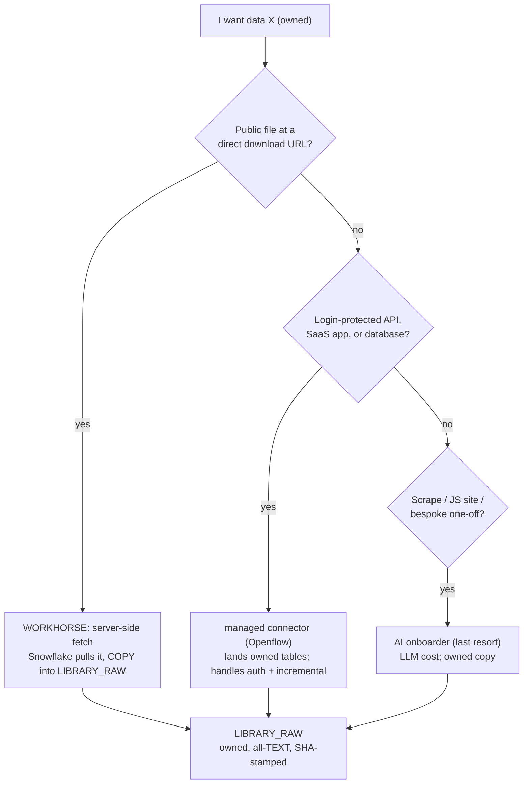

# Get Any/All Data Into MY Database (owned copies) — Cheap and Fast

## The rule (beer version)

You want the bytes in your possession, always. So every path ends the same way: a real
copy sitting in `LIBRARY_RAW`, all-TEXT, SHA-stamped, exactly as it arrived. The game is
**picking the cheapest, fastest way to get that copy** — not whether to copy. Most published
data is a file at a URL, and Snowflake can now pull those itself (no laptop). The rest is
either a login-protected API (a managed connector handles it) or a weird one-off (the AI
agent, used last because it costs LLM money and time).

## What I confirmed about your setup (grounded this session)

- Everything already lands as an **owned all-TEXT copy** in `LIBRARY_RAW` — that pattern
  stays; we're widening what can reach it and lowering the cost.
- **Server-side fetch works** (`scripts/server_side_load.py` + `infra/ddl/08_bulk_ingest.sql`):
  Snowflake pulls a direct-download URL onto its own compute and COPYs it. Proven on CFPB
  (17.2M rows). X-Small handled 1.4 GB fine.
- **The AI agent** (`onboard.py`) can reach APIs/scrapes/JS but costs ~3-4 Claude calls per
  source and is the slowest path. Its big gap: **auth'd APIs are skipped, not solved**
  (`_auth_gate`).
- **No managed connectors** (Openflow unused) — the clean fix for login-protected APIs/SaaS/DBs.
- **Budget is tight:** `RIPPLE_BUDGET` = 30 credits/month, auto-suspend at 90%. Since you're
  keeping copies, **storage becomes the recurring cost** — so storage discipline matters.
- **No Snowflake TASKs** — scheduling today is a macOS `launchd` job that won't run on your
  Windows machine.

## The ladder (every path ends in an owned copy)

The point: push as many sources onto the **workhorse** as possible (cheapest + fastest to a
copy), use connectors for the auth wall, and reserve the AI agent for genuine oddballs.

## Implementation steps (phased; each stands alone)

### Phase 1 — Make server-side fetch the default workhorse (the cheap win)
Most public data is a file at a URL; this owns it fast with no laptop and no LLM. Harden
`server_side_load.py` / `08_bulk_ingest.sql`:
- **GLEIF-style resolver hop** (302 / metadata-JSON → real link) so redirecting sources work.
- **Headerless-file support** (spec flag → synthesize `C1..CN` columns).
- **Widen the host allow-list** as new sources come up (one network-rule edit).
- Route all public bulk sources here instead of the AI agent; keep `bridge_fuel_load.py` for
  the already-known URLs.

### Phase 2 — Close the auth'd-API gap: managed connectors
The class the AI agent skips today. Two options (Decision 2 below):
- **Openflow** (Snowflake-native managed connectors): handles OAuth, pagination, schema drift,
  and incremental — writes owned tables into your DB, no custom code, no LLM.
- **Lighter path:** add a **keyed-fetch** mode to the server-side proc using the SECRET slot
  already anticipated in `08_bulk_ingest.sql` — good for simple API-key sources.

### Phase 3 — Keep the AI agent for the true long tail only
Scrapes, JS-rendered sites, bespoke formats. Everything that fits Phase 1/2 stops burning
LLM budget. This is about *routing away* from the expensive tool, not changing it.

### Phase 4 — Cost discipline for possession (storage is the recurring bill now)
- **Incremental refresh by default** (watermark append; machinery exists: `ingest._watermark`)
  so you don't re-store unchanged data every cycle.
- **Storage lifecycle policy** to archive/expire cold raw tables (big historical pulls you
  rarely query) — keeps possession without paying full-rate storage forever.
- Keep `RIPPLE_BUDGET` as the hard cap; raise only for one-time sprints (`budget_sprint.py`).
- All-TEXT raw compresses well in Snowflake; the copy is cheaper to hold than it looks.

### Phase 5 — Portable, unattended refresh: Snowflake TASKs
Replace the macOS-only `launchd` heartbeat with **Snowflake TASKs** (serverless, run in the
cloud regardless of your laptop/OS). Schedule per the freshness ledger's cadence buckets so
owned copies stay current on their own.

### Phase 6 — One intake funnel ("any data someday")
A single "I want data X" entry point that walks the ladder, picks the cheapest copy path,
lands it in `LIBRARY_RAW`, and records which tier it used in `SOURCE_REGISTRY`. Makes the
cheap path the default path for whatever you want next.

## Verification (prove each on one source before scaling)
- Phase 1: land one redirecting source (GLEIF) and one headerless file end-to-end, verify row counts + density.
- Phase 2: run one login-protected API through the chosen connector; confirm an owned table lands.
- Phase 4: re-run a source incrementally; confirm only new rows added, no full re-store.
- Phase 5: one Snowflake TASK refreshes one source on schedule, unattended, within budget.

## Decisions that are yours (RED)
1. **Monthly spend ceiling.** Possession = ongoing storage + refresh compute. Today's cap is
   30 credits/month. What's the real ceiling you're comfortable with?
2. **Auth'd-API approach:** full **Openflow** (more power, more setup) vs the lighter
   **keyed-fetch** path first? (Some sources may still need Openflow either way.)
3. **Which data first** — where the light points (mission call).
4. **How far now** — just Phase 1 (cheap, high-value), or commit to the whole program?

## Critical files
- [scripts/server_side_load.py](scripts/server_side_load.py) - the workhorse; Phase 1 hardening.
- [infra/ddl/08_bulk_ingest.sql](infra/ddl/08_bulk_ingest.sql) - egress/stage/procs + SECRET slot for keyed APIs.
- [library-onboarding/onboard.py](library-onboarding/onboard.py) - AI agent (Tier 4) + `_auth_gate` gap Phase 2 closes.
- [infra/ddl/03_warehouses_roles_monitor.sql](infra/ddl/03_warehouses_roles_monitor.sql) - `RIPPLE_BUDGET` cap (cost guardrail).
- [infra/ddl/04_freshness_ledger.sql](infra/ddl/04_freshness_ledger.sql) - cadence buckets that drive Phase 5 scheduling.
