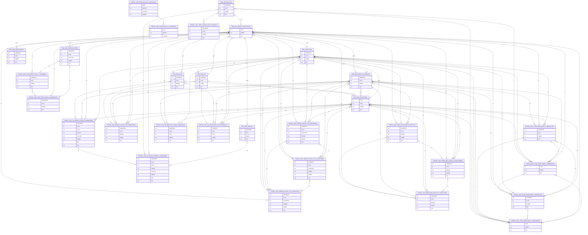

# Joins on CCN  ·  30 datasets, 101 links

```mermaid
erDiagram
  FED_CMS_DIALYSIS {
    col ADDRESS
    id CCN
    col NAME
    col ZIP
  }
  FED_CMS_FACILITY_AFFILIATION {
    id CCN
    col NAME
    id NPI
  }
  FED_CMS_HCRIS {
    col ADDRESS
    id CCN
    col NAME
    col ZIP
  }
  FED_CMS_HOME_HEALTH {
    col ADDRESS
    id CCN
    col NAME
    col ZIP
  }
  FED_CMS_HOSPICE {
    col ADDRESS
    id CCN
    col NAME
    col ZIP
  }
  FED_CMS_HOSPITAL_GENERAL {
    col ADDRESS
    id CCN
    col NAME
    col ZIP
  }
  FED_CMS_IRF {
    col ADDRESS
    id CCN
    col NAME
    col ZIP
  }
  FED_CMS_LTCH {
    col ADDRESS
    id CCN
    col NAME
    col ZIP
  }
  FED_CMS_NURSING_HOME {
    col ADDRESS
    id CCN
    col LATLON
    col NAME
    col ZIP
  }
  FED_CMS_POS_OTHER {
    id CCN
    col FIPS
    col NAME
    col ZIP
  }
  PORTAL_ARC_HARRIS_COUNTY_OP_5AB72D4A23 {
    col ADDRESS
    id CCN
    col COUNTRY
    col GEOM
    col NAME
    col ZIP
  }
  PORTAL_ARC_HARRIS_COUNTY_OP_CAF5C156E3 {
    col ADDRESS
    id CCN
    col COUNTRY
    col GEOM
    col NAME
    col ZIP
  }
  PORTAL_ARC_HARRIS_COUNTY_OP_CBD49C80E4 {
    col ADDRESS
    id CCN
    col GEOM
    col NAME
    col ZIP
  }
  PORTAL_ARC_HARRIS_COUNTY_OP_FE2134F2C8 {
    col ADDRESS
    id CCN
    col COUNTRY
    col GEOM
    col NAME
    col ZIP
  }
  PORTAL_ARC_LA_COUNTY_OPEN_D_0A94DB308E {
    col ADDRESS
    id CCN
    col FIPS
    col GEOM
    col LATLON
    col NAME
    id NPI
    col ZIP
  }
  PORTAL_ARC_LA_COUNTY_OPEN_D_1EDD056661 {
    col ADDRESS
    id CCN
    col FIPS
    col GEOM
    col LATLON
    col NAME
    id NPI
    col ZIP
  }
  PORTAL_ARC_OPEN_BALTIMORE_6C2257F1C4 {
    col ADDRESS
    id CCN
    col GEOM
    col NAME
    col ZIP
  }
  PORTAL_ARC_OPEN_DATA_DC_59913164D2 {
    id CCN
    col GEOM
    col LATLON
    col NAME
  }
  PORTAL_ARC_OPEN_DATA_DC_74D9616143 {
    id CCN
    col GEOM
    col LATLON
  }
  PORTAL_SOC_CONNECTICUT_OPEN_9A34CD28AE {
    col ADDRESS
    id CCN
    col FIPS
    col NAME
    col ZIP
  }
  PORTAL_SOC_MARYLAND_OPEN_DA_1B2CC0ADB9 {
    col ADDRESS
    id CCN
    col GEOM
    col NAME
    col ZIP
  }
  PORTAL_SOC_MARYLAND_OPEN_DA_7CE817C5CE {
    col ADDRESS
    id CCN
    col GEOM
    col NAME
    col ZIP
  }
  PORTAL_SOC_PA_OPEN_DATA_POR_CD66682741 {
    col ADDRESS
    id CCN
    col FIPS
    col NAME
    col ZIP
  }
  PORTAL_SOC_TEXAS_OPEN_DATA_F525266F32 {
    col ADDRESS
    id CCN
    col NAME
    col ZIP
  }
  PORTAL_SOC_UTAH_OPEN_DATA_P_7186EDB84B {
    col ADDRESS
    id CCN
    col NAME
    col ZIP
  }
  PORTAL_SOC_UTAH_OPEN_DATA_P_A5AE4FD7A4 {
    col ADDRESS
    id CCN
    col NAME
    col ZIP
  }
  PORTAL_SOC_UTAH_OPEN_DATA_P_A9B7E273C8 {
    col ADDRESS
    id CCN
    col NAME
    col ZIP
  }
  PORTAL_SOC_UTAH_OPEN_DATA_P_C68BC3F05C {
    id CCN
    col NAME
    col ZIP
  }
  PORTAL_SOC_UTAH_OPEN_DATA_P_DCD75231F6 {
    col ADDRESS
    id CCN
    col NAME
    col ZIP
  }
  PORTAL_SOC_UTAH_OPEN_DATA_P_FB07CFAF59 {
    id CCN
    col NAME
    col ZIP
  }
  FED_CMS_FACILITY_AFFILIATION }o--o{ FED_CMS_NURSING_HOME : "13,085"
  FED_CMS_FACILITY_AFFILIATION }o--o{ FED_CMS_HOME_HEALTH : "7,645"
  FED_CMS_DIALYSIS }o--o{ FED_CMS_FACILITY_AFFILIATION : "7,345"
  FED_CMS_HCRIS }o--o{ FED_CMS_POS_OTHER : "6,037"
  FED_CMS_HOSPITAL_GENERAL }o--o{ FED_CMS_POS_OTHER : "5,423"
  FED_CMS_FACILITY_AFFILIATION }o--o{ FED_CMS_HOSPICE : "5,346"
  FED_CMS_FACILITY_AFFILIATION }o--o{ FED_CMS_HCRIS : "5,158"
  FED_CMS_HCRIS }o--o{ FED_CMS_HOSPITAL_GENERAL : "5,144"
  FED_CMS_FACILITY_AFFILIATION }o--o{ FED_CMS_HOSPITAL_GENERAL : "4,565"
  FED_CMS_FACILITY_AFFILIATION }o--o{ FED_CMS_IRF : "1,140"
  FED_CMS_HOSPICE }o--o{ PORTAL_ARC_LA_COUNTY_OPEN_D_1EDD056661 : "530"
  FED_CMS_FACILITY_AFFILIATION }o--o{ PORTAL_ARC_LA_COUNTY_OPEN_D_1EDD056661 : "422"
  FED_CMS_IRF }o--o{ FED_CMS_POS_OTHER : "410"
  FED_CMS_HCRIS }o--o{ FED_CMS_IRF : "370"
  FED_CMS_LTCH }o--o{ FED_CMS_POS_OTHER : "311"
  FED_CMS_FACILITY_AFFILIATION }o--o{ FED_CMS_LTCH : "303"
  FED_CMS_HCRIS }o--o{ FED_CMS_LTCH : "302"
  FED_CMS_POS_OTHER }o--o{ PORTAL_SOC_PA_OPEN_DATA_POR_CD66682741 : "183"
  FED_CMS_HCRIS }o--o{ PORTAL_SOC_PA_OPEN_DATA_POR_CD66682741 : "168"
  FED_CMS_FACILITY_AFFILIATION }o--o{ PORTAL_SOC_PA_OPEN_DATA_POR_CD66682741 : "166"
  FED_CMS_HOSPITAL_GENERAL }o--o{ PORTAL_SOC_PA_OPEN_DATA_POR_CD66682741 : "152"
  FED_CMS_DIALYSIS }o--o{ PORTAL_ARC_LA_COUNTY_OPEN_D_1EDD056661 : "95"
  FED_CMS_NURSING_HOME }o--o{ PORTAL_SOC_UTAH_OPEN_DATA_P_A5AE4FD7A4 : "87"
  FED_CMS_POS_OTHER }o--o{ PORTAL_ARC_LA_COUNTY_OPEN_D_0A94DB308E : "85"
  FED_CMS_HCRIS }o--o{ PORTAL_ARC_LA_COUNTY_OPEN_D_0A94DB308E : "83"
  FED_CMS_FACILITY_AFFILIATION }o--o{ PORTAL_ARC_LA_COUNTY_OPEN_D_0A94DB308E : "81"
  FED_CMS_FACILITY_AFFILIATION }o--o{ PORTAL_SOC_UTAH_OPEN_DATA_P_A5AE4FD7A4 : "78"
  FED_CMS_HOSPITAL_GENERAL }o--o{ PORTAL_ARC_LA_COUNTY_OPEN_D_0A94DB308E : "74"
  FED_CMS_POS_OTHER }o--o{ PORTAL_ARC_HARRIS_COUNTY_OP_CBD49C80E4 : "62"
  PORTAL_SOC_MARYLAND_OPEN_DA_1B2CC0ADB9 }o--o{ PORTAL_SOC_MARYLAND_OPEN_DA_7CE817C5CE : "61"
  FED_CMS_POS_OTHER }o--o{ PORTAL_SOC_UTAH_OPEN_DATA_P_DCD75231F6 : "60"
  FED_CMS_POS_OTHER }o--o{ PORTAL_SOC_MARYLAND_OPEN_DA_7CE817C5CE : "60"
  FED_CMS_POS_OTHER }o--o{ PORTAL_SOC_MARYLAND_OPEN_DA_1B2CC0ADB9 : "60"
  FED_CMS_POS_OTHER }o--o{ PORTAL_SOC_UTAH_OPEN_DATA_P_A9B7E273C8 : "59"
  FED_CMS_HCRIS }o--o{ PORTAL_SOC_UTAH_OPEN_DATA_P_A9B7E273C8 : "57"
  PORTAL_SOC_UTAH_OPEN_DATA_P_A9B7E273C8 }o--o{ PORTAL_SOC_UTAH_OPEN_DATA_P_DCD75231F6 : "56"
  FED_CMS_HCRIS }o--o{ PORTAL_SOC_MARYLAND_OPEN_DA_7CE817C5CE : "56"
  FED_CMS_HCRIS }o--o{ PORTAL_SOC_MARYLAND_OPEN_DA_1B2CC0ADB9 : "56"
  FED_CMS_HCRIS }o--o{ PORTAL_SOC_UTAH_OPEN_DATA_P_DCD75231F6 : "54"
  FED_CMS_HOSPITAL_GENERAL }o--o{ PORTAL_SOC_MARYLAND_OPEN_DA_7CE817C5CE : "51"
  FED_CMS_HOSPITAL_GENERAL }o--o{ PORTAL_SOC_MARYLAND_OPEN_DA_1B2CC0ADB9 : "51"
  FED_CMS_FACILITY_AFFILIATION }o--o{ PORTAL_SOC_UTAH_OPEN_DATA_P_A9B7E273C8 : "50"
  FED_CMS_HOSPITAL_GENERAL }o--o{ PORTAL_SOC_UTAH_OPEN_DATA_P_A9B7E273C8 : "49"
  FED_CMS_HCRIS }o--o{ PORTAL_ARC_HARRIS_COUNTY_OP_CBD49C80E4 : "49"
  FED_CMS_FACILITY_AFFILIATION }o--o{ PORTAL_SOC_MARYLAND_OPEN_DA_1B2CC0ADB9 : "48"
  FED_CMS_FACILITY_AFFILIATION }o--o{ PORTAL_SOC_MARYLAND_OPEN_DA_7CE817C5CE : "48"
  FED_CMS_FACILITY_AFFILIATION }o--o{ PORTAL_SOC_UTAH_OPEN_DATA_P_DCD75231F6 : "47"
  FED_CMS_HOSPITAL_GENERAL }o--o{ PORTAL_SOC_UTAH_OPEN_DATA_P_DCD75231F6 : "46"
  FED_CMS_FACILITY_AFFILIATION }o--o{ PORTAL_ARC_HARRIS_COUNTY_OP_CBD49C80E4 : "40"
  FED_CMS_HOSPITAL_GENERAL }o--o{ PORTAL_ARC_HARRIS_COUNTY_OP_CBD49C80E4 : "38"
  FED_CMS_HCRIS }o--o{ PORTAL_SOC_CONNECTICUT_OPEN_9A34CD28AE : "30"
  FED_CMS_POS_OTHER }o--o{ PORTAL_SOC_CONNECTICUT_OPEN_9A34CD28AE : "30"
  FED_CMS_FACILITY_AFFILIATION }o--o{ PORTAL_SOC_CONNECTICUT_OPEN_9A34CD28AE : "29"
  FED_CMS_HOSPITAL_GENERAL }o--o{ PORTAL_SOC_CONNECTICUT_OPEN_9A34CD28AE : "27"
  PORTAL_ARC_OPEN_BALTIMORE_6C2257F1C4 }o--o{ PORTAL_SOC_MARYLAND_OPEN_DA_7CE817C5CE : "21"
  PORTAL_ARC_OPEN_BALTIMORE_6C2257F1C4 }o--o{ PORTAL_SOC_MARYLAND_OPEN_DA_1B2CC0ADB9 : "21"
  FED_CMS_POS_OTHER }o--o{ PORTAL_ARC_OPEN_BALTIMORE_6C2257F1C4 : "21"
  FED_CMS_DIALYSIS }o--o{ PORTAL_SOC_TEXAS_OPEN_DATA_F525266F32 : "21"
  FED_CMS_HOSPITAL_GENERAL }o--o{ PORTAL_ARC_OPEN_BALTIMORE_6C2257F1C4 : "20"
  FED_CMS_HCRIS }o--o{ PORTAL_ARC_OPEN_BALTIMORE_6C2257F1C4 : "20"
  FED_CMS_FACILITY_AFFILIATION }o--o{ PORTAL_ARC_OPEN_BALTIMORE_6C2257F1C4 : "18"
  PORTAL_ARC_HARRIS_COUNTY_OP_5AB72D4A23 }o--o{ PORTAL_ARC_HARRIS_COUNTY_OP_CAF5C156E3 : "15"
  PORTAL_ARC_HARRIS_COUNTY_OP_CAF5C156E3 }o--o{ PORTAL_ARC_HARRIS_COUNTY_OP_FE2134F2C8 : "15"
  PORTAL_ARC_HARRIS_COUNTY_OP_5AB72D4A23 }o--o{ PORTAL_ARC_HARRIS_COUNTY_OP_FE2134F2C8 : "15"
  PORTAL_SOC_UTAH_OPEN_DATA_P_7186EDB84B }o--o{ PORTAL_SOC_UTAH_OPEN_DATA_P_A5AE4FD7A4 : "14"
  FED_CMS_NURSING_HOME }o--o{ PORTAL_SOC_UTAH_OPEN_DATA_P_7186EDB84B : "13"
  FED_CMS_POS_OTHER }o--o{ PORTAL_ARC_HARRIS_COUNTY_OP_5AB72D4A23 : "13"
  FED_CMS_POS_OTHER }o--o{ PORTAL_ARC_HARRIS_COUNTY_OP_CAF5C156E3 : "13"
  FED_CMS_POS_OTHER }o--o{ PORTAL_ARC_HARRIS_COUNTY_OP_FE2134F2C8 : "13"
  FED_CMS_HOSPITAL_GENERAL }o--o{ PORTAL_ARC_HARRIS_COUNTY_OP_5AB72D4A23 : "12"
  FED_CMS_HOSPITAL_GENERAL }o--o{ PORTAL_ARC_HARRIS_COUNTY_OP_FE2134F2C8 : "12"
  FED_CMS_HOSPITAL_GENERAL }o--o{ PORTAL_ARC_HARRIS_COUNTY_OP_CAF5C156E3 : "12"
  FED_CMS_HCRIS }o--o{ PORTAL_ARC_HARRIS_COUNTY_OP_FE2134F2C8 : "12"
  FED_CMS_HCRIS }o--o{ PORTAL_ARC_HARRIS_COUNTY_OP_5AB72D4A23 : "12"
  FED_CMS_HCRIS }o--o{ PORTAL_ARC_HARRIS_COUNTY_OP_CAF5C156E3 : "12"
  FED_CMS_FACILITY_AFFILIATION }o--o{ PORTAL_ARC_HARRIS_COUNTY_OP_5AB72D4A23 : "12"
  FED_CMS_FACILITY_AFFILIATION }o--o{ PORTAL_ARC_HARRIS_COUNTY_OP_CAF5C156E3 : "12"
  FED_CMS_FACILITY_AFFILIATION }o--o{ PORTAL_ARC_HARRIS_COUNTY_OP_FE2134F2C8 : "12"
  FED_CMS_LTCH }o--o{ PORTAL_SOC_PA_OPEN_DATA_POR_CD66682741 : "12"
  FED_CMS_FACILITY_AFFILIATION }o--o{ PORTAL_SOC_UTAH_OPEN_DATA_P_7186EDB84B : "11"
  PORTAL_ARC_LA_COUNTY_OPEN_D_0A94DB308E }o--o{ PORTAL_ARC_LA_COUNTY_OPEN_D_1EDD056661 : "10"
  PORTAL_SOC_UTAH_OPEN_DATA_P_C68BC3F05C }o--o{ PORTAL_SOC_UTAH_OPEN_DATA_P_FB07CFAF59 : "9"
  FED_CMS_FACILITY_AFFILIATION }o--o{ PORTAL_SOC_UTAH_OPEN_DATA_P_C68BC3F05C : "6"
  FED_CMS_FACILITY_AFFILIATION }o--o{ PORTAL_SOC_UTAH_OPEN_DATA_P_FB07CFAF59 : "6"
  FED_CMS_IRF }o--o{ PORTAL_ARC_HARRIS_COUNTY_OP_CBD49C80E4 : "6"
  FED_CMS_LTCH }o--o{ PORTAL_ARC_LA_COUNTY_OPEN_D_0A94DB308E : "6"
  FED_CMS_LTCH }o--o{ PORTAL_ARC_HARRIS_COUNTY_OP_CBD49C80E4 : "5"
  PORTAL_ARC_OPEN_DATA_DC_59913164D2 }o--o{ PORTAL_ARC_OPEN_DATA_DC_74D9616143 : "4"
  PORTAL_SOC_UTAH_OPEN_DATA_P_DCD75231F6 }o--o{ PORTAL_SOC_UTAH_OPEN_DATA_P_FB07CFAF59 : "4"
  PORTAL_SOC_UTAH_OPEN_DATA_P_A9B7E273C8 }o--o{ PORTAL_SOC_UTAH_OPEN_DATA_P_FB07CFAF59 : "4"
  PORTAL_SOC_UTAH_OPEN_DATA_P_A9B7E273C8 }o--o{ PORTAL_SOC_UTAH_OPEN_DATA_P_C68BC3F05C : "4"
  PORTAL_SOC_UTAH_OPEN_DATA_P_C68BC3F05C }o--o{ PORTAL_SOC_UTAH_OPEN_DATA_P_DCD75231F6 : "4"
  FED_CMS_HOSPITAL_GENERAL }o--o{ PORTAL_SOC_UTAH_OPEN_DATA_P_FB07CFAF59 : "4"
  FED_CMS_HOSPITAL_GENERAL }o--o{ PORTAL_SOC_UTAH_OPEN_DATA_P_C68BC3F05C : "4"
  FED_CMS_HCRIS }o--o{ PORTAL_SOC_UTAH_OPEN_DATA_P_FB07CFAF59 : "4"
  FED_CMS_HCRIS }o--o{ PORTAL_SOC_UTAH_OPEN_DATA_P_C68BC3F05C : "4"
  FED_CMS_POS_OTHER }o--o{ PORTAL_SOC_UTAH_OPEN_DATA_P_FB07CFAF59 : "4"
  FED_CMS_POS_OTHER }o--o{ PORTAL_SOC_UTAH_OPEN_DATA_P_C68BC3F05C : "4"
  FED_CMS_DIALYSIS }o--o{ PORTAL_SOC_UTAH_OPEN_DATA_P_FB07CFAF59 : "3"
  FED_CMS_DIALYSIS }o--o{ PORTAL_SOC_UTAH_OPEN_DATA_P_C68BC3F05C : "3"
  FED_CMS_IRF }o--o{ PORTAL_SOC_PA_OPEN_DATA_POR_CD66682741 : "3"
```
