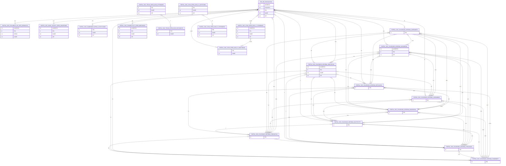

# Joins on EIN  ·  21 datasets, 64 links

```mermaid
erDiagram
  FED_IRS_REVOCATION {
    col ADDRESS
    col COUNTRY
    id EIN
    col NAME
    col ZIP
  }
  PORTAL_ARC_COLUMBUS_GIS_OPE_8259461C2A {
    col ADDRESS
    id EIN
    col GEOM
    col NAME
  }
  PORTAL_ARC_WAKE_COUNTY_OPEN_4B425FD089 {
    col ADDRESS
    id EIN
    col NAME
    col ZIP
  }
  PORTAL_SOC_CAMBRIDGE_OPEN_D_FB7C7229D0 {
    id EIN
    col NAME
    col ZIP
  }
  PORTAL_SOC_COLORADO_INFORMA_239FBA8B76 {
    id EIN
  }
  PORTAL_SOC_COLORADO_INFORMA_46101BE391 {
    col ADDRESS
    id EIN
    col ZIP
  }
  PORTAL_SOC_COLORADO_INFORMA_4BAD70F01F {
    col ADDRESS
    id EIN
    col NAME
    col ZIP
  }
  PORTAL_SOC_COLORADO_INFORMA_6367A44C92 {
    id EIN
  }
  PORTAL_SOC_COLORADO_INFORMA_A50DA9B699 {
    id EIN
  }
  PORTAL_SOC_COLORADO_INFORMA_B4DD509314 {
    id EIN
  }
  PORTAL_SOC_COLORADO_INFORMA_D017CFCF7F {
    id EIN
  }
  PORTAL_SOC_COLORADO_INFORMA_F0E162D7A8 {
    id EIN
  }
  PORTAL_SOC_COLORADO_INFORMA_F78543C045 {
    id EIN
  }
  PORTAL_SOC_COLORADO_INFORMA_F9498D9B7F {
    id EIN
  }
  PORTAL_SOC_CONNECTICUT_OPEN_6BE2302812 {
    col ADDRESS
    id EIN
    col NAME
    col ZIP
  }
  PORTAL_SOC_TEXAS_OPEN_DATA_6F798A64FA {
    id EIN
    col NAME
    col ZIP
  }
  PORTAL_SOC_TEXAS_OPEN_DATA_91F1C8D27D {
    id EIN
    col NAME
  }
  PORTAL_SOC_UTAH_OPEN_DATA_P_17CB6B615F {
    col ADDRESS
    id EIN
    col NAME
    col ZIP
  }
  PORTAL_SOC_UTAH_OPEN_DATA_P_8A9374EA5D {
    id EIN
    col NAME
  }
  PORTAL_SOC_UTAH_OPEN_DATA_P_C357F1F9E1 {
    id EIN
    col NAME
    col ZIP
  }
  PORTAL_SOC_UTAH_OPEN_DATA_P_F87FB2BFB7 {
    id EIN
    col NAME
    col ZIP
  }
  PORTAL_SOC_UTAH_OPEN_DATA_P_17CB6B615F }o--o{ PORTAL_SOC_UTAH_OPEN_DATA_P_8A9374EA5D : "2,460"
  FED_IRS_REVOCATION }o--o{ PORTAL_SOC_UTAH_OPEN_DATA_P_17CB6B615F : "1,202"
  FED_IRS_REVOCATION }o--o{ PORTAL_SOC_UTAH_OPEN_DATA_P_8A9374EA5D : "1,028"
  PORTAL_SOC_COLORADO_INFORMA_A50DA9B699 }o--o{ PORTAL_SOC_COLORADO_INFORMA_B4DD509314 : "1,024"
  PORTAL_SOC_COLORADO_INFORMA_6367A44C92 }o--o{ PORTAL_SOC_COLORADO_INFORMA_F9498D9B7F : "1,001"
  PORTAL_SOC_COLORADO_INFORMA_239FBA8B76 }o--o{ PORTAL_SOC_COLORADO_INFORMA_F9498D9B7F : "977"
  PORTAL_SOC_COLORADO_INFORMA_239FBA8B76 }o--o{ PORTAL_SOC_COLORADO_INFORMA_6367A44C92 : "946"
  PORTAL_SOC_COLORADO_INFORMA_B4DD509314 }o--o{ PORTAL_SOC_COLORADO_INFORMA_F9498D9B7F : "895"
  PORTAL_SOC_COLORADO_INFORMA_A50DA9B699 }o--o{ PORTAL_SOC_COLORADO_INFORMA_F9498D9B7F : "894"
  PORTAL_SOC_COLORADO_INFORMA_6367A44C92 }o--o{ PORTAL_SOC_COLORADO_INFORMA_B4DD509314 : "860"
  PORTAL_SOC_COLORADO_INFORMA_6367A44C92 }o--o{ PORTAL_SOC_COLORADO_INFORMA_A50DA9B699 : "859"
  PORTAL_SOC_COLORADO_INFORMA_239FBA8B76 }o--o{ PORTAL_SOC_COLORADO_INFORMA_A50DA9B699 : "843"
  PORTAL_SOC_COLORADO_INFORMA_239FBA8B76 }o--o{ PORTAL_SOC_COLORADO_INFORMA_46101BE391 : "841"
  PORTAL_SOC_COLORADO_INFORMA_239FBA8B76 }o--o{ PORTAL_SOC_COLORADO_INFORMA_B4DD509314 : "840"
  PORTAL_SOC_COLORADO_INFORMA_46101BE391 }o--o{ PORTAL_SOC_COLORADO_INFORMA_F9498D9B7F : "818"
  PORTAL_SOC_COLORADO_INFORMA_46101BE391 }o--o{ PORTAL_SOC_COLORADO_INFORMA_6367A44C92 : "798"
  PORTAL_SOC_COLORADO_INFORMA_46101BE391 }o--o{ PORTAL_SOC_COLORADO_INFORMA_A50DA9B699 : "717"
  PORTAL_SOC_COLORADO_INFORMA_46101BE391 }o--o{ PORTAL_SOC_COLORADO_INFORMA_B4DD509314 : "713"
  PORTAL_SOC_COLORADO_INFORMA_46101BE391 }o--o{ PORTAL_SOC_COLORADO_INFORMA_F0E162D7A8 : "483"
  FED_IRS_REVOCATION }o--o{ PORTAL_ARC_COLUMBUS_GIS_OPE_8259461C2A : "421"
  FED_IRS_REVOCATION }o--o{ PORTAL_SOC_CONNECTICUT_OPEN_6BE2302812 : "411"
  FED_IRS_REVOCATION }o--o{ PORTAL_SOC_COLORADO_INFORMA_4BAD70F01F : "229"
  FED_IRS_REVOCATION }o--o{ PORTAL_ARC_WAKE_COUNTY_OPEN_4B425FD089 : "172"
  FED_IRS_REVOCATION }o--o{ PORTAL_SOC_COLORADO_INFORMA_F0E162D7A8 : "154"
  PORTAL_SOC_COLORADO_INFORMA_46101BE391 }o--o{ PORTAL_SOC_COLORADO_INFORMA_D017CFCF7F : "144"
  PORTAL_SOC_COLORADO_INFORMA_D017CFCF7F }o--o{ PORTAL_SOC_COLORADO_INFORMA_F78543C045 : "142"
  PORTAL_SOC_COLORADO_INFORMA_239FBA8B76 }o--o{ PORTAL_SOC_COLORADO_INFORMA_D017CFCF7F : "142"
  PORTAL_SOC_COLORADO_INFORMA_D017CFCF7F }o--o{ PORTAL_SOC_COLORADO_INFORMA_F9498D9B7F : "141"
  PORTAL_SOC_COLORADO_INFORMA_A50DA9B699 }o--o{ PORTAL_SOC_COLORADO_INFORMA_D017CFCF7F : "140"
  PORTAL_SOC_COLORADO_INFORMA_B4DD509314 }o--o{ PORTAL_SOC_COLORADO_INFORMA_D017CFCF7F : "138"
  PORTAL_SOC_COLORADO_INFORMA_6367A44C92 }o--o{ PORTAL_SOC_COLORADO_INFORMA_D017CFCF7F : "137"
  PORTAL_SOC_COLORADO_INFORMA_46101BE391 }o--o{ PORTAL_SOC_COLORADO_INFORMA_F78543C045 : "131"
  PORTAL_SOC_COLORADO_INFORMA_239FBA8B76 }o--o{ PORTAL_SOC_COLORADO_INFORMA_F78543C045 : "129"
  PORTAL_SOC_COLORADO_INFORMA_F78543C045 }o--o{ PORTAL_SOC_COLORADO_INFORMA_F9498D9B7F : "123"
  FED_IRS_REVOCATION }o--o{ PORTAL_SOC_CAMBRIDGE_OPEN_D_FB7C7229D0 : "123"
  PORTAL_SOC_COLORADO_INFORMA_A50DA9B699 }o--o{ PORTAL_SOC_COLORADO_INFORMA_F78543C045 : "122"
  PORTAL_SOC_COLORADO_INFORMA_B4DD509314 }o--o{ PORTAL_SOC_COLORADO_INFORMA_F78543C045 : "121"
  PORTAL_SOC_COLORADO_INFORMA_6367A44C92 }o--o{ PORTAL_SOC_COLORADO_INFORMA_F78543C045 : "120"
  FED_IRS_REVOCATION }o--o{ PORTAL_SOC_COLORADO_INFORMA_46101BE391 : "115"
  PORTAL_SOC_COLORADO_INFORMA_A50DA9B699 }o--o{ PORTAL_SOC_COLORADO_INFORMA_F0E162D7A8 : "86"
  PORTAL_SOC_COLORADO_INFORMA_46101BE391 }o--o{ PORTAL_SOC_COLORADO_INFORMA_4BAD70F01F : "86"
  PORTAL_SOC_COLORADO_INFORMA_4BAD70F01F }o--o{ PORTAL_SOC_COLORADO_INFORMA_A50DA9B699 : "85"
  FED_IRS_REVOCATION }o--o{ PORTAL_SOC_COLORADO_INFORMA_B4DD509314 : "85"
  PORTAL_SOC_COLORADO_INFORMA_4BAD70F01F }o--o{ PORTAL_SOC_COLORADO_INFORMA_B4DD509314 : "83"
  FED_IRS_REVOCATION }o--o{ PORTAL_SOC_COLORADO_INFORMA_A50DA9B699 : "79"
  PORTAL_SOC_COLORADO_INFORMA_B4DD509314 }o--o{ PORTAL_SOC_COLORADO_INFORMA_F0E162D7A8 : "78"
  FED_IRS_REVOCATION }o--o{ PORTAL_SOC_COLORADO_INFORMA_6367A44C92 : "78"
  FED_IRS_REVOCATION }o--o{ PORTAL_SOC_COLORADO_INFORMA_F9498D9B7F : "78"
  PORTAL_SOC_COLORADO_INFORMA_4BAD70F01F }o--o{ PORTAL_SOC_COLORADO_INFORMA_F9498D9B7F : "70"
  FED_IRS_REVOCATION }o--o{ PORTAL_SOC_COLORADO_INFORMA_239FBA8B76 : "70"
  PORTAL_SOC_COLORADO_INFORMA_4BAD70F01F }o--o{ PORTAL_SOC_COLORADO_INFORMA_F0E162D7A8 : "69"
  PORTAL_SOC_COLORADO_INFORMA_F0E162D7A8 }o--o{ PORTAL_SOC_COLORADO_INFORMA_F9498D9B7F : "68"
  PORTAL_SOC_COLORADO_INFORMA_4BAD70F01F }o--o{ PORTAL_SOC_COLORADO_INFORMA_6367A44C92 : "68"
  PORTAL_SOC_COLORADO_INFORMA_239FBA8B76 }o--o{ PORTAL_SOC_COLORADO_INFORMA_4BAD70F01F : "66"
  PORTAL_SOC_COLORADO_INFORMA_239FBA8B76 }o--o{ PORTAL_SOC_COLORADO_INFORMA_F0E162D7A8 : "65"
  PORTAL_SOC_COLORADO_INFORMA_6367A44C92 }o--o{ PORTAL_SOC_COLORADO_INFORMA_F0E162D7A8 : "63"
  PORTAL_SOC_COLORADO_INFORMA_4BAD70F01F }o--o{ PORTAL_SOC_COLORADO_INFORMA_D017CFCF7F : "26"
  PORTAL_SOC_UTAH_OPEN_DATA_P_C357F1F9E1 }o--o{ PORTAL_SOC_UTAH_OPEN_DATA_P_F87FB2BFB7 : "23"
  PORTAL_SOC_COLORADO_INFORMA_F0E162D7A8 }o--o{ PORTAL_SOC_COLORADO_INFORMA_F78543C045 : "7"
  PORTAL_SOC_COLORADO_INFORMA_D017CFCF7F }o--o{ PORTAL_SOC_COLORADO_INFORMA_F0E162D7A8 : "7"
  PORTAL_SOC_COLORADO_INFORMA_4BAD70F01F }o--o{ PORTAL_SOC_COLORADO_INFORMA_F78543C045 : "6"
  FED_IRS_REVOCATION }o--o{ PORTAL_SOC_COLORADO_INFORMA_F78543C045 : "6"
  PORTAL_SOC_TEXAS_OPEN_DATA_6F798A64FA }o--o{ PORTAL_SOC_TEXAS_OPEN_DATA_91F1C8D27D : "5"
  FED_IRS_REVOCATION }o--o{ PORTAL_SOC_COLORADO_INFORMA_D017CFCF7F : "5"
```
