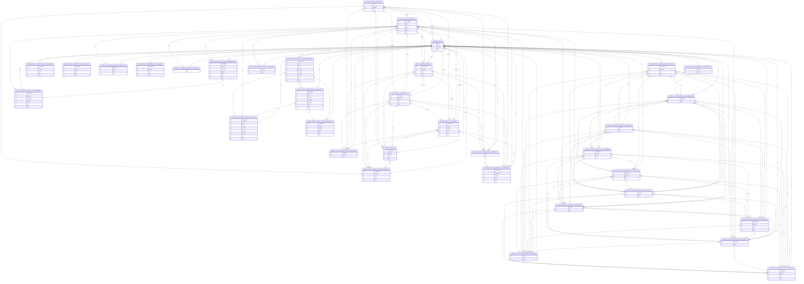

# Joins on NPI  ·  35 datasets, 143 links

```mermaid
erDiagram
  FED_CMS_FACILITY_AFFILIATION {
    id CCN
    col NAME
    id NPI
  }
  FED_CMS_MEDICARE_PROVIDER {
    col COUNTRY
    col FIPS
    col NAME
    id NPI
    col ZIP
  }
  FED_CMS_NPPES {
    id EIN
    col NAME
    id NPI
  }
  FED_CMS_OPEN_PAYMENTS {
    col COUNTRY
    col NAME
    id NPI
    col ZIP
  }
  FED_CMS_OPEN_PAYMENTS_2023 {
    col COUNTRY
    col NAME
    id NPI
    col ZIP
  }
  FED_CMS_PART_D_PRESCRIBERS {
    col COUNTRY
    col FIPS
    col NAME
    id NPI
    col ZIP
  }
  FED_HHS_OIG_LEIE {
    col ADDRESS
    col NAME
    id NPI
    col ZIP
  }
  PORTAL_ARC_HARRIS_COUNTY_OP_86AE12CFC0 {
    col ADDRESS
    col GEOM
    col LATLON
    col NAME
    id NPI
    col ZIP
  }
  PORTAL_ARC_HARRIS_COUNTY_OP_FA9969D82E {
    col ADDRESS
    col GEOM
    col LATLON
    col NAME
    id NPI
    col ZIP
  }
  PORTAL_ARC_LA_COUNTY_OPEN_D_0A94DB308E {
    col ADDRESS
    id CCN
    col FIPS
    col GEOM
    col LATLON
    col NAME
    id NPI
    col ZIP
  }
  PORTAL_ARC_LA_COUNTY_OPEN_D_1A6706943D {
    col ADDRESS
    col FIPS
    col GEOM
    col LATLON
    col NAME
    id NPI
    col ZIP
  }
  PORTAL_ARC_LA_COUNTY_OPEN_D_1EDD056661 {
    col ADDRESS
    id CCN
    col FIPS
    col GEOM
    col LATLON
    col NAME
    id NPI
    col ZIP
  }
  PORTAL_ARC_LA_COUNTY_OPEN_D_6DF63A4983 {
    col ADDRESS
    col GEOM
    col NAME
    id NPI
    col ZIP
  }
  PORTAL_ARC_LA_COUNTY_OPEN_D_83F0BA30FB {
    col ADDRESS
    col NAME
    id NPI
    col ZIP
  }
  PORTAL_ARC_LA_COUNTY_OPEN_D_E034245E05 {
    col ADDRESS
    col NAME
    id NPI
    col ZIP
  }
  PORTAL_SOC_NJ_OPEN_DATA_CEN_A0D94510CA {
    col ADDRESS
    col NAME
    id NPI
    col ZIP
  }
  PORTAL_SOC_OREGON_OPEN_DATA_E338C547C2 {
    col NAME
    id NPI
    col ZIP
  }
  PORTAL_SOC_SF_OPENDATA_DATA_8DCCC91916 {
    col NAME
    id NPI
  }
  PORTAL_SOC_SF_OPENDATA_DATA_C19EE9EB44 {
    col ADDRESS
    col NAME
    id NPI
    col ZIP
  }
  PORTAL_SOC_TEXAS_OPEN_DATA_A7AB49CB1A {
    id NPI
  }
  PORTAL_SOC_UTAH_OPEN_DATA_P_1A3EDE9CAD {
    col NAME
    id NPI
  }
  PORTAL_SOC_UTAH_OPEN_DATA_P_4EBA247771 {
    col ADDRESS
    col NAME
    id NPI
    col ZIP
  }
  PORTAL_SOC_UTAH_OPEN_DATA_P_52003D36F8 {
    col NAME
    id NPI
  }
  PORTAL_SOC_UTAH_OPEN_DATA_P_55EF6EF0C6 {
    id NPI
  }
  PORTAL_SOC_UTAH_OPEN_DATA_P_5EF25AF42C {
    col NAME
    id NPI
  }
  PORTAL_SOC_UTAH_OPEN_DATA_P_62BB6C079E {
    col ADDRESS
    col COUNTRY
    col NAME
    id NPI
    col ZIP
  }
  PORTAL_SOC_UTAH_OPEN_DATA_P_6F316DE0B0 {
    col ADDRESS
    col NAME
    id NPI
  }
  PORTAL_SOC_UTAH_OPEN_DATA_P_701571FD92 {
    col ADDRESS
    col NAME
    id NPI
  }
  PORTAL_SOC_UTAH_OPEN_DATA_P_990C78C284 {
    col NAME
    id NPI
  }
  PORTAL_SOC_UTAH_OPEN_DATA_P_AC08D0651F {
    col NAME
    id NPI
  }
  PORTAL_SOC_UTAH_OPEN_DATA_P_D4ACA49A9B {
    col ADDRESS
    col NAME
    id NPI
    col ZIP
  }
  PORTAL_SOC_UTAH_OPEN_DATA_P_F10F70DE47 {
    col NAME
    id NPI
  }
  PORTAL_SOC_UTAH_OPEN_DATA_P_F7CB1E8C0D {
    col NAME
    id NPI
  }
  PORTAL_SOC_UTAH_OPEN_DATA_P_F8CDD62630 {
    col ADDRESS
    col NAME
    id NPI
    col ZIP
  }
  PORTAL_SOC_WASHINGTON_STATE_914CF85743 {
    col NAME
    id NPI
  }
  FED_CMS_NPPES }o--o{ FED_CMS_PART_D_PRESCRIBERS : "1,416,881"
  FED_CMS_MEDICARE_PROVIDER }o--o{ FED_CMS_NPPES : "1,296,736"
  FED_CMS_NPPES }o--o{ FED_CMS_OPEN_PAYMENTS : "979,132"
  FED_CMS_FACILITY_AFFILIATION }o--o{ FED_CMS_NPPES : "938,299"
  FED_CMS_NPPES }o--o{ FED_CMS_OPEN_PAYMENTS_2023 : "933,611"
  FED_CMS_MEDICARE_PROVIDER }o--o{ FED_CMS_PART_D_PRESCRIBERS : "861,300"
  FED_CMS_FACILITY_AFFILIATION }o--o{ FED_CMS_MEDICARE_PROVIDER : "810,435"
  FED_CMS_OPEN_PAYMENTS }o--o{ FED_CMS_PART_D_PRESCRIBERS : "734,802"
  FED_CMS_OPEN_PAYMENTS }o--o{ FED_CMS_OPEN_PAYMENTS_2023 : "714,130"
  FED_CMS_FACILITY_AFFILIATION }o--o{ FED_CMS_PART_D_PRESCRIBERS : "706,912"
  FED_CMS_OPEN_PAYMENTS_2023 }o--o{ FED_CMS_PART_D_PRESCRIBERS : "704,161"
  FED_CMS_MEDICARE_PROVIDER }o--o{ FED_CMS_OPEN_PAYMENTS : "601,867"
  FED_CMS_MEDICARE_PROVIDER }o--o{ FED_CMS_OPEN_PAYMENTS_2023 : "577,659"
  FED_CMS_FACILITY_AFFILIATION }o--o{ FED_CMS_OPEN_PAYMENTS : "500,731"
  FED_CMS_FACILITY_AFFILIATION }o--o{ FED_CMS_OPEN_PAYMENTS_2023 : "473,088"
  FED_CMS_NPPES }o--o{ FED_HHS_OIG_LEIE : "8,503"
  FED_CMS_NPPES }o--o{ PORTAL_SOC_SF_OPENDATA_DATA_8DCCC91916 : "1,265"
  PORTAL_ARC_HARRIS_COUNTY_OP_86AE12CFC0 }o--o{ PORTAL_ARC_HARRIS_COUNTY_OP_FA9969D82E : "1,128"
  FED_CMS_NPPES }o--o{ PORTAL_ARC_HARRIS_COUNTY_OP_86AE12CFC0 : "1,128"
  FED_CMS_NPPES }o--o{ PORTAL_ARC_HARRIS_COUNTY_OP_FA9969D82E : "1,128"
  FED_CMS_NPPES }o--o{ PORTAL_ARC_LA_COUNTY_OPEN_D_1A6706943D : "947"
  FED_CMS_NPPES }o--o{ PORTAL_SOC_UTAH_OPEN_DATA_P_55EF6EF0C6 : "766"
  FED_CMS_NPPES }o--o{ PORTAL_ARC_LA_COUNTY_OPEN_D_1EDD056661 : "703"
  FED_CMS_MEDICARE_PROVIDER }o--o{ PORTAL_SOC_UTAH_OPEN_DATA_P_55EF6EF0C6 : "659"
  FED_CMS_NPPES }o--o{ PORTAL_SOC_UTAH_OPEN_DATA_P_D4ACA49A9B : "531"
  FED_CMS_PART_D_PRESCRIBERS }o--o{ PORTAL_SOC_UTAH_OPEN_DATA_P_55EF6EF0C6 : "515"
  FED_CMS_NPPES }o--o{ PORTAL_SOC_UTAH_OPEN_DATA_P_F8CDD62630 : "499"
  FED_CMS_NPPES }o--o{ PORTAL_SOC_NJ_OPEN_DATA_CEN_A0D94510CA : "484"
  FED_CMS_MEDICARE_PROVIDER }o--o{ PORTAL_ARC_HARRIS_COUNTY_OP_FA9969D82E : "467"
  FED_CMS_MEDICARE_PROVIDER }o--o{ PORTAL_ARC_HARRIS_COUNTY_OP_86AE12CFC0 : "467"
  FED_CMS_FACILITY_AFFILIATION }o--o{ PORTAL_SOC_UTAH_OPEN_DATA_P_55EF6EF0C6 : "462"
  FED_CMS_OPEN_PAYMENTS_2023 }o--o{ FED_HHS_OIG_LEIE : "439"
  PORTAL_SOC_UTAH_OPEN_DATA_P_D4ACA49A9B }o--o{ PORTAL_SOC_UTAH_OPEN_DATA_P_F8CDD62630 : "427"
  FED_CMS_NPPES }o--o{ PORTAL_SOC_UTAH_OPEN_DATA_P_4EBA247771 : "420"
  FED_CMS_NPPES }o--o{ PORTAL_SOC_UTAH_OPEN_DATA_P_62BB6C079E : "397"
  FED_CMS_OPEN_PAYMENTS_2023 }o--o{ PORTAL_SOC_UTAH_OPEN_DATA_P_55EF6EF0C6 : "388"
  FED_CMS_NPPES }o--o{ PORTAL_SOC_UTAH_OPEN_DATA_P_52003D36F8 : "374"
  FED_CMS_OPEN_PAYMENTS }o--o{ PORTAL_SOC_UTAH_OPEN_DATA_P_55EF6EF0C6 : "371"
  PORTAL_ARC_LA_COUNTY_OPEN_D_1A6706943D }o--o{ PORTAL_ARC_LA_COUNTY_OPEN_D_1EDD056661 : "350"
  FED_CMS_OPEN_PAYMENTS }o--o{ FED_HHS_OIG_LEIE : "350"
  PORTAL_SOC_UTAH_OPEN_DATA_P_4EBA247771 }o--o{ PORTAL_SOC_UTAH_OPEN_DATA_P_D4ACA49A9B : "331"
  FED_CMS_PART_D_PRESCRIBERS }o--o{ PORTAL_SOC_UTAH_OPEN_DATA_P_62BB6C079E : "304"
  PORTAL_SOC_UTAH_OPEN_DATA_P_4EBA247771 }o--o{ PORTAL_SOC_UTAH_OPEN_DATA_P_F8CDD62630 : "299"
  FED_CMS_NPPES }o--o{ PORTAL_SOC_TEXAS_OPEN_DATA_A7AB49CB1A : "276"
  FED_CMS_MEDICARE_PROVIDER }o--o{ PORTAL_SOC_UTAH_OPEN_DATA_P_62BB6C079E : "270"
  FED_CMS_MEDICARE_PROVIDER }o--o{ PORTAL_SOC_TEXAS_OPEN_DATA_A7AB49CB1A : "258"
  FED_CMS_PART_D_PRESCRIBERS }o--o{ FED_HHS_OIG_LEIE : "243"
  FED_CMS_FACILITY_AFFILIATION }o--o{ PORTAL_SOC_UTAH_OPEN_DATA_P_62BB6C079E : "240"
  FED_CMS_NPPES }o--o{ PORTAL_SOC_UTAH_OPEN_DATA_P_701571FD92 : "231"
  FED_CMS_NPPES }o--o{ PORTAL_SOC_UTAH_OPEN_DATA_P_5EF25AF42C : "222"
  FED_CMS_NPPES }o--o{ PORTAL_SOC_UTAH_OPEN_DATA_P_6F316DE0B0 : "197"
  FED_CMS_NPPES }o--o{ PORTAL_SOC_WASHINGTON_STATE_914CF85743 : "195"
  FED_CMS_OPEN_PAYMENTS_2023 }o--o{ PORTAL_SOC_UTAH_OPEN_DATA_P_62BB6C079E : "195"
  FED_CMS_OPEN_PAYMENTS }o--o{ PORTAL_SOC_UTAH_OPEN_DATA_P_62BB6C079E : "192"
  FED_CMS_NPPES }o--o{ PORTAL_ARC_LA_COUNTY_OPEN_D_6DF63A4983 : "185"
  FED_CMS_MEDICARE_PROVIDER }o--o{ PORTAL_SOC_WASHINGTON_STATE_914CF85743 : "162"
  FED_HHS_OIG_LEIE }o--o{ PORTAL_SOC_NJ_OPEN_DATA_CEN_A0D94510CA : "159"
  PORTAL_SOC_UTAH_OPEN_DATA_P_6F316DE0B0 }o--o{ PORTAL_SOC_UTAH_OPEN_DATA_P_701571FD92 : "154"
  PORTAL_SOC_UTAH_OPEN_DATA_P_4EBA247771 }o--o{ PORTAL_SOC_UTAH_OPEN_DATA_P_5EF25AF42C : "151"
  FED_CMS_NPPES }o--o{ PORTAL_SOC_UTAH_OPEN_DATA_P_F10F70DE47 : "144"
  PORTAL_SOC_UTAH_OPEN_DATA_P_5EF25AF42C }o--o{ PORTAL_SOC_UTAH_OPEN_DATA_P_D4ACA49A9B : "141"
  FED_CMS_NPPES }o--o{ PORTAL_SOC_UTAH_OPEN_DATA_P_F7CB1E8C0D : "135"
  PORTAL_SOC_UTAH_OPEN_DATA_P_5EF25AF42C }o--o{ PORTAL_SOC_UTAH_OPEN_DATA_P_F8CDD62630 : "134"
  PORTAL_SOC_UTAH_OPEN_DATA_P_4EBA247771 }o--o{ PORTAL_SOC_UTAH_OPEN_DATA_P_52003D36F8 : "132"
  PORTAL_SOC_UTAH_OPEN_DATA_P_4EBA247771 }o--o{ PORTAL_SOC_UTAH_OPEN_DATA_P_6F316DE0B0 : "131"
  PORTAL_SOC_UTAH_OPEN_DATA_P_52003D36F8 }o--o{ PORTAL_SOC_UTAH_OPEN_DATA_P_D4ACA49A9B : "130"
  PORTAL_SOC_UTAH_OPEN_DATA_P_6F316DE0B0 }o--o{ PORTAL_SOC_UTAH_OPEN_DATA_P_D4ACA49A9B : "128"
  PORTAL_SOC_UTAH_OPEN_DATA_P_701571FD92 }o--o{ PORTAL_SOC_UTAH_OPEN_DATA_P_D4ACA49A9B : "123"
  PORTAL_SOC_UTAH_OPEN_DATA_P_4EBA247771 }o--o{ PORTAL_SOC_UTAH_OPEN_DATA_P_701571FD92 : "122"
  PORTAL_SOC_UTAH_OPEN_DATA_P_6F316DE0B0 }o--o{ PORTAL_SOC_UTAH_OPEN_DATA_P_F8CDD62630 : "121"
  FED_CMS_PART_D_PRESCRIBERS }o--o{ PORTAL_SOC_SF_OPENDATA_DATA_8DCCC91916 : "121"
  PORTAL_SOC_UTAH_OPEN_DATA_P_52003D36F8 }o--o{ PORTAL_SOC_UTAH_OPEN_DATA_P_F8CDD62630 : "118"
  PORTAL_SOC_UTAH_OPEN_DATA_P_701571FD92 }o--o{ PORTAL_SOC_UTAH_OPEN_DATA_P_F8CDD62630 : "116"
  FED_CMS_MEDICARE_PROVIDER }o--o{ FED_HHS_OIG_LEIE : "112"
  PORTAL_SOC_UTAH_OPEN_DATA_P_52003D36F8 }o--o{ PORTAL_SOC_UTAH_OPEN_DATA_P_6F316DE0B0 : "109"
  FED_CMS_NPPES }o--o{ PORTAL_SOC_UTAH_OPEN_DATA_P_990C78C284 : "108"
  PORTAL_SOC_UTAH_OPEN_DATA_P_5EF25AF42C }o--o{ PORTAL_SOC_UTAH_OPEN_DATA_P_6F316DE0B0 : "108"
  PORTAL_SOC_UTAH_OPEN_DATA_P_52003D36F8 }o--o{ PORTAL_SOC_UTAH_OPEN_DATA_P_701571FD92 : "105"
  FED_CMS_MEDICARE_PROVIDER }o--o{ PORTAL_SOC_SF_OPENDATA_DATA_8DCCC91916 : "102"
  FED_CMS_NPPES }o--o{ PORTAL_SOC_UTAH_OPEN_DATA_P_AC08D0651F : "97"
  PORTAL_SOC_UTAH_OPEN_DATA_P_5EF25AF42C }o--o{ PORTAL_SOC_UTAH_OPEN_DATA_P_701571FD92 : "97"
  PORTAL_SOC_UTAH_OPEN_DATA_P_F10F70DE47 }o--o{ PORTAL_SOC_UTAH_OPEN_DATA_P_F7CB1E8C0D : "96"
  FED_CMS_MEDICARE_PROVIDER }o--o{ PORTAL_ARC_LA_COUNTY_OPEN_D_1EDD056661 : "92"
  FED_CMS_NPPES }o--o{ PORTAL_SOC_SF_OPENDATA_DATA_C19EE9EB44 : "85"
  PORTAL_SOC_UTAH_OPEN_DATA_P_990C78C284 }o--o{ PORTAL_SOC_UTAH_OPEN_DATA_P_F10F70DE47 : "85"
  PORTAL_SOC_UTAH_OPEN_DATA_P_52003D36F8 }o--o{ PORTAL_SOC_UTAH_OPEN_DATA_P_5EF25AF42C : "80"
  FED_CMS_NPPES }o--o{ PORTAL_ARC_LA_COUNTY_OPEN_D_0A94DB308E : "79"
  FED_CMS_PART_D_PRESCRIBERS }o--o{ PORTAL_SOC_NJ_OPEN_DATA_CEN_A0D94510CA : "73"
  PORTAL_ARC_LA_COUNTY_OPEN_D_0A94DB308E }o--o{ PORTAL_ARC_LA_COUNTY_OPEN_D_1A6706943D : "71"
  PORTAL_SOC_UTAH_OPEN_DATA_P_990C78C284 }o--o{ PORTAL_SOC_UTAH_OPEN_DATA_P_F7CB1E8C0D : "67"
  FED_CMS_OPEN_PAYMENTS_2023 }o--o{ PORTAL_SOC_NJ_OPEN_DATA_CEN_A0D94510CA : "66"
  PORTAL_SOC_UTAH_OPEN_DATA_P_AC08D0651F }o--o{ PORTAL_SOC_UTAH_OPEN_DATA_P_F7CB1E8C0D : "65"
  FED_CMS_OPEN_PAYMENTS }o--o{ PORTAL_SOC_NJ_OPEN_DATA_CEN_A0D94510CA : "62"
  PORTAL_SOC_UTAH_OPEN_DATA_P_AC08D0651F }o--o{ PORTAL_SOC_UTAH_OPEN_DATA_P_F10F70DE47 : "60"
  PORTAL_SOC_UTAH_OPEN_DATA_P_990C78C284 }o--o{ PORTAL_SOC_UTAH_OPEN_DATA_P_AC08D0651F : "54"
  FED_CMS_NPPES }o--o{ PORTAL_SOC_UTAH_OPEN_DATA_P_1A3EDE9CAD : "52"
  FED_CMS_MEDICARE_PROVIDER }o--o{ PORTAL_SOC_NJ_OPEN_DATA_CEN_A0D94510CA : "39"
  PORTAL_ARC_LA_COUNTY_OPEN_D_0A94DB308E }o--o{ PORTAL_ARC_LA_COUNTY_OPEN_D_6DF63A4983 : "38"
  PORTAL_ARC_LA_COUNTY_OPEN_D_1A6706943D }o--o{ PORTAL_ARC_LA_COUNTY_OPEN_D_6DF63A4983 : "34"
  FED_CMS_NPPES }o--o{ PORTAL_SOC_OREGON_OPEN_DATA_E338C547C2 : "24"
  FED_CMS_OPEN_PAYMENTS }o--o{ PORTAL_SOC_SF_OPENDATA_DATA_8DCCC91916 : "21"
  FED_CMS_MEDICARE_PROVIDER }o--o{ PORTAL_SOC_OREGON_OPEN_DATA_E338C547C2 : "19"
  PORTAL_SOC_UTAH_OPEN_DATA_P_1A3EDE9CAD }o--o{ PORTAL_SOC_UTAH_OPEN_DATA_P_52003D36F8 : "15"
  PORTAL_SOC_UTAH_OPEN_DATA_P_4EBA247771 }o--o{ PORTAL_SOC_UTAH_OPEN_DATA_P_F7CB1E8C0D : "15"
  PORTAL_SOC_UTAH_OPEN_DATA_P_D4ACA49A9B }o--o{ PORTAL_SOC_UTAH_OPEN_DATA_P_F10F70DE47 : "15"
  FED_CMS_FACILITY_AFFILIATION }o--o{ PORTAL_SOC_SF_OPENDATA_DATA_8DCCC91916 : "15"
  FED_CMS_OPEN_PAYMENTS_2023 }o--o{ PORTAL_SOC_SF_OPENDATA_DATA_8DCCC91916 : "15"
  PORTAL_SOC_UTAH_OPEN_DATA_P_D4ACA49A9B }o--o{ PORTAL_SOC_UTAH_OPEN_DATA_P_F7CB1E8C0D : "14"
  PORTAL_SOC_UTAH_OPEN_DATA_P_4EBA247771 }o--o{ PORTAL_SOC_UTAH_OPEN_DATA_P_F10F70DE47 : "13"
  PORTAL_SOC_UTAH_OPEN_DATA_P_F10F70DE47 }o--o{ PORTAL_SOC_UTAH_OPEN_DATA_P_F8CDD62630 : "13"
  FED_CMS_FACILITY_AFFILIATION }o--o{ PORTAL_SOC_NJ_OPEN_DATA_CEN_A0D94510CA : "13"
  PORTAL_SOC_UTAH_OPEN_DATA_P_F7CB1E8C0D }o--o{ PORTAL_SOC_UTAH_OPEN_DATA_P_F8CDD62630 : "12"
  FED_CMS_MEDICARE_PROVIDER }o--o{ PORTAL_SOC_UTAH_OPEN_DATA_P_F10F70DE47 : "12"
  PORTAL_SOC_UTAH_OPEN_DATA_P_52003D36F8 }o--o{ PORTAL_SOC_UTAH_OPEN_DATA_P_F7CB1E8C0D : "11"
  FED_CMS_FACILITY_AFFILIATION }o--o{ FED_HHS_OIG_LEIE : "11"
  PORTAL_SOC_UTAH_OPEN_DATA_P_52003D36F8 }o--o{ PORTAL_SOC_UTAH_OPEN_DATA_P_AC08D0651F : "10"
  PORTAL_SOC_UTAH_OPEN_DATA_P_52003D36F8 }o--o{ PORTAL_SOC_UTAH_OPEN_DATA_P_F10F70DE47 : "10"
  PORTAL_SOC_UTAH_OPEN_DATA_P_55EF6EF0C6 }o--o{ PORTAL_SOC_UTAH_OPEN_DATA_P_62BB6C079E : "10"
  PORTAL_SOC_UTAH_OPEN_DATA_P_4EBA247771 }o--o{ PORTAL_SOC_UTAH_OPEN_DATA_P_AC08D0651F : "9"
  FED_CMS_MEDICARE_PROVIDER }o--o{ PORTAL_SOC_UTAH_OPEN_DATA_P_AC08D0651F : "9"
  PORTAL_SOC_UTAH_OPEN_DATA_P_990C78C284 }o--o{ PORTAL_SOC_UTAH_OPEN_DATA_P_D4ACA49A9B : "9"
  PORTAL_SOC_UTAH_OPEN_DATA_P_5EF25AF42C }o--o{ PORTAL_SOC_UTAH_OPEN_DATA_P_F7CB1E8C0D : "9"
  PORTAL_ARC_LA_COUNTY_OPEN_D_0A94DB308E }o--o{ PORTAL_ARC_LA_COUNTY_OPEN_D_1EDD056661 : "8"
  PORTAL_SOC_UTAH_OPEN_DATA_P_AC08D0651F }o--o{ PORTAL_SOC_UTAH_OPEN_DATA_P_D4ACA49A9B : "8"
  PORTAL_SOC_UTAH_OPEN_DATA_P_52003D36F8 }o--o{ PORTAL_SOC_UTAH_OPEN_DATA_P_990C78C284 : "8"
  PORTAL_SOC_UTAH_OPEN_DATA_P_4EBA247771 }o--o{ PORTAL_SOC_UTAH_OPEN_DATA_P_990C78C284 : "7"
  PORTAL_SOC_UTAH_OPEN_DATA_P_990C78C284 }o--o{ PORTAL_SOC_UTAH_OPEN_DATA_P_F8CDD62630 : "7"
  FED_CMS_MEDICARE_PROVIDER }o--o{ PORTAL_SOC_UTAH_OPEN_DATA_P_F7CB1E8C0D : "7"
  PORTAL_SOC_UTAH_OPEN_DATA_P_5EF25AF42C }o--o{ PORTAL_SOC_UTAH_OPEN_DATA_P_F10F70DE47 : "7"
  FED_CMS_NPPES }o--o{ PORTAL_ARC_LA_COUNTY_OPEN_D_E034245E05 : "6"
  PORTAL_SOC_UTAH_OPEN_DATA_P_AC08D0651F }o--o{ PORTAL_SOC_UTAH_OPEN_DATA_P_F8CDD62630 : "6"
  PORTAL_SOC_UTAH_OPEN_DATA_P_5EF25AF42C }o--o{ PORTAL_SOC_UTAH_OPEN_DATA_P_AC08D0651F : "6"
  PORTAL_SOC_UTAH_OPEN_DATA_P_701571FD92 }o--o{ PORTAL_SOC_UTAH_OPEN_DATA_P_990C78C284 : "6"
  FED_CMS_MEDICARE_PROVIDER }o--o{ PORTAL_SOC_UTAH_OPEN_DATA_P_990C78C284 : "6"
  PORTAL_SOC_UTAH_OPEN_DATA_P_6F316DE0B0 }o--o{ PORTAL_SOC_UTAH_OPEN_DATA_P_F7CB1E8C0D : "6"
  PORTAL_SOC_UTAH_OPEN_DATA_P_701571FD92 }o--o{ PORTAL_SOC_UTAH_OPEN_DATA_P_F7CB1E8C0D : "6"
  PORTAL_SOC_UTAH_OPEN_DATA_P_701571FD92 }o--o{ PORTAL_SOC_UTAH_OPEN_DATA_P_F10F70DE47 : "6"
  FED_CMS_NPPES }o--o{ PORTAL_ARC_LA_COUNTY_OPEN_D_83F0BA30FB : "5"
  PORTAL_SOC_UTAH_OPEN_DATA_P_701571FD92 }o--o{ PORTAL_SOC_UTAH_OPEN_DATA_P_AC08D0651F : "5"
  PORTAL_SOC_UTAH_OPEN_DATA_P_6F316DE0B0 }o--o{ PORTAL_SOC_UTAH_OPEN_DATA_P_AC08D0651F : "5"
  PORTAL_SOC_UTAH_OPEN_DATA_P_6F316DE0B0 }o--o{ PORTAL_SOC_UTAH_OPEN_DATA_P_990C78C284 : "5"
  PORTAL_SOC_UTAH_OPEN_DATA_P_5EF25AF42C }o--o{ PORTAL_SOC_UTAH_OPEN_DATA_P_990C78C284 : "5"
  PORTAL_SOC_UTAH_OPEN_DATA_P_6F316DE0B0 }o--o{ PORTAL_SOC_UTAH_OPEN_DATA_P_F10F70DE47 : "5"
```
